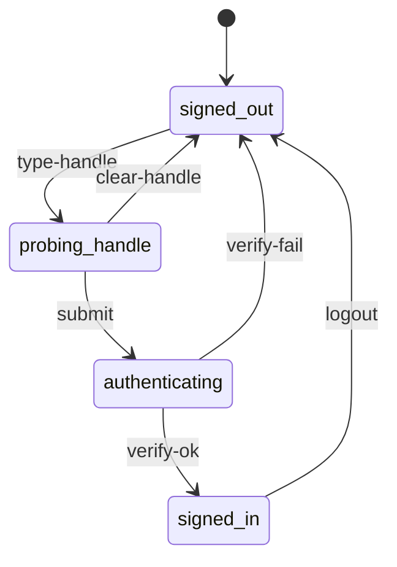
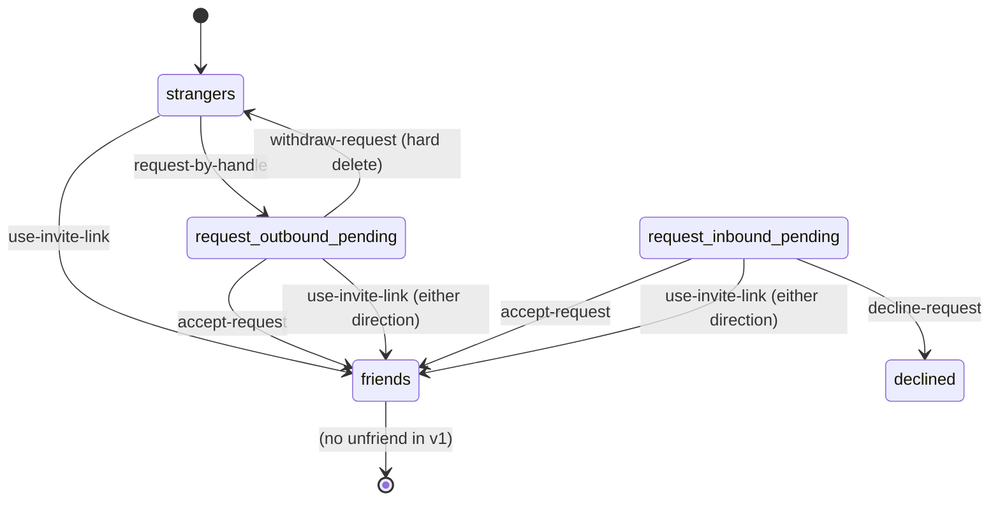
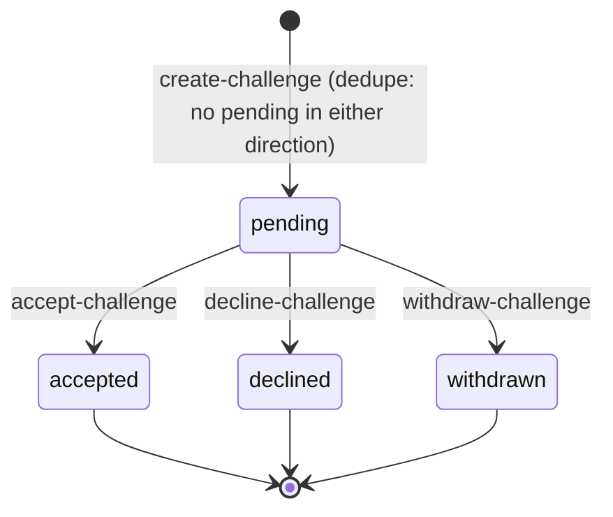
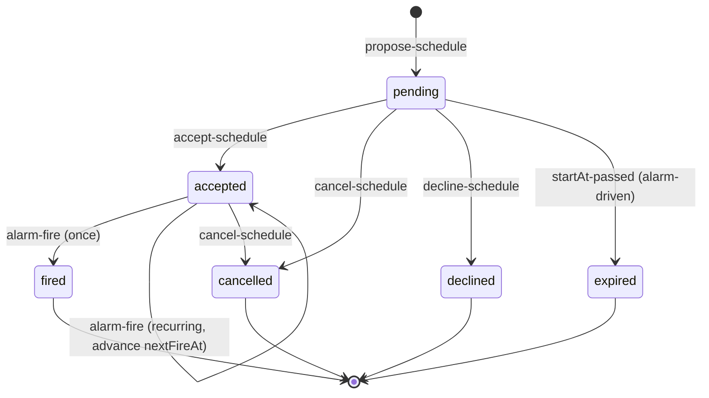
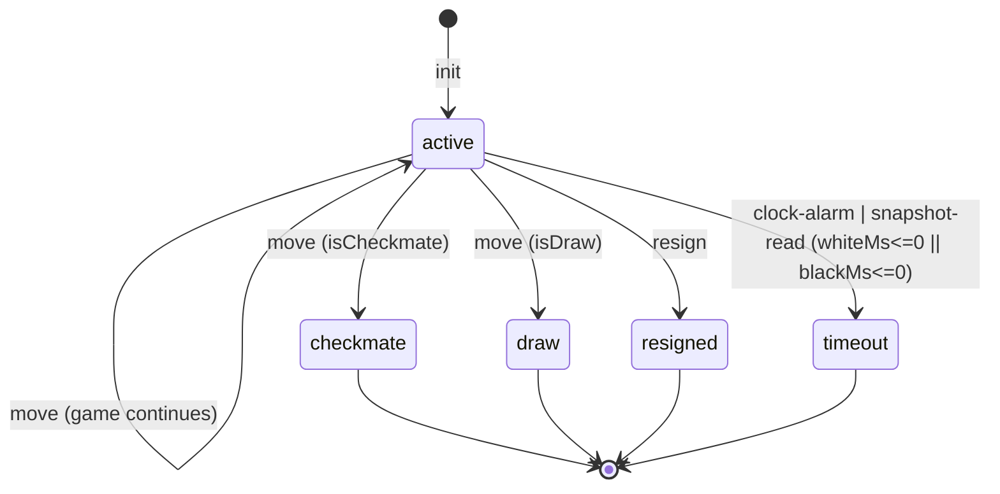
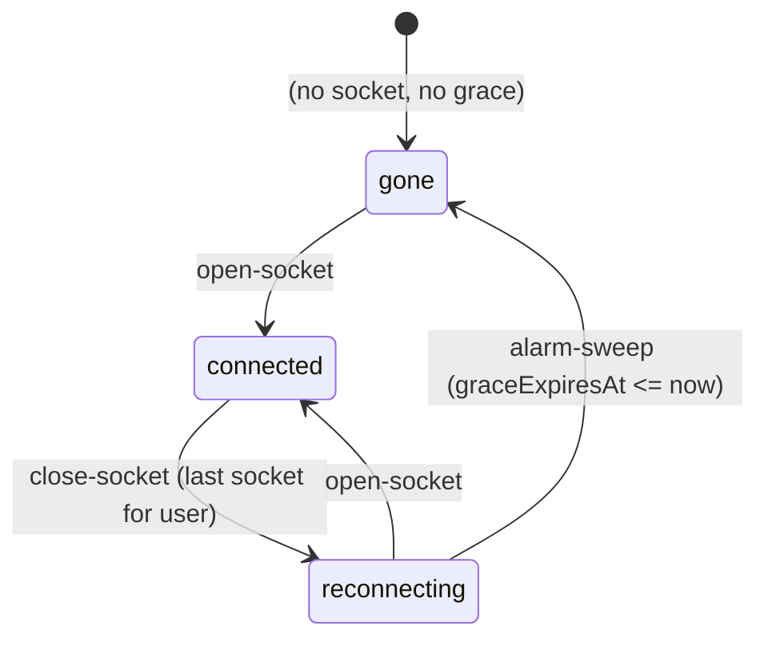
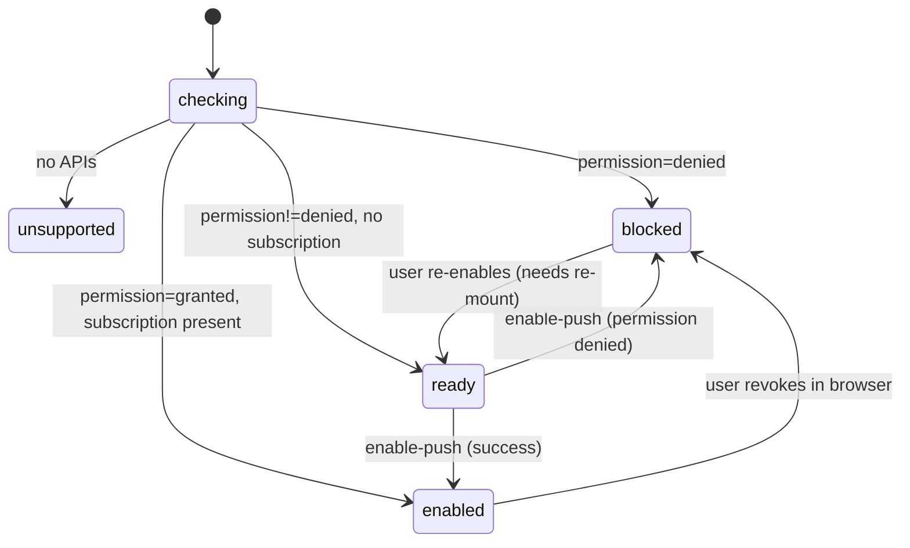
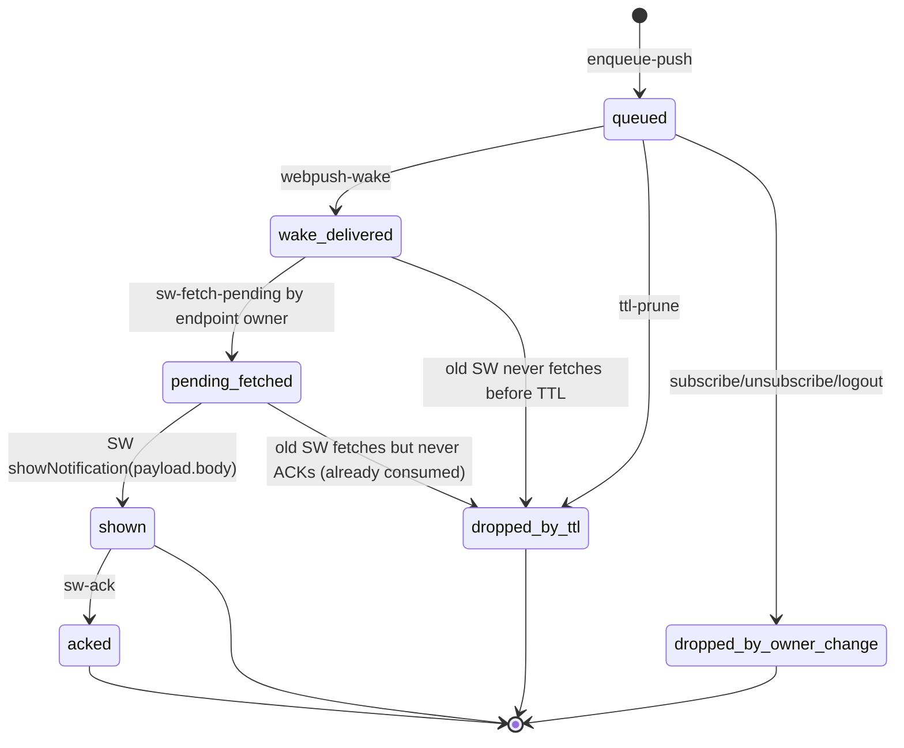
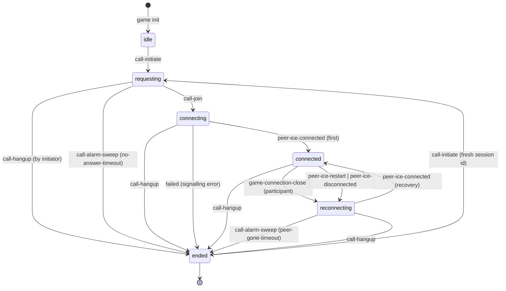

# two chairs — state machines (audit + model)

*Owner: the state-machine architect role. Any change to state, transitions,
guards, or single writers must land here in the same commit as the code that
introduces it. This file is what every future agent reads to know the shape
of the system before touching it.*

## Status log

GAP-N identifiers are stable — do not renumber. Commit messages and test
names cite them (`state-smith GAP-N`). New gaps found in the audit are
appended at the next unused number.

- **c7bc407** (2026-08-04) — initial audit committed.
- **7878939** (post c7bc407) — GAP-2 (challenge withdraw + decline
  endpoints), GAP-3 (create-challenge dedupe in either direction), GAP-14
  (WaitingRoom terminals for withdrawn / declined) closed. Also closes
  GAP-1 on the surface: the Friends row now projects `sentChallenges` /
  `challenges` / accepted `schedules` and renders `Invited` / `Accept` /
  `Scheduled` in place of the unconditional `Invite` button, and the
  Dashboard's `In play` section carries a `WaitingRow` per outgoing
  pending challenge with a Withdraw action.
- **9b084a2** (2026-08-05) — GAP-4 (friend-request decline), GAP-5
  (friend-request withdraw as hard delete), GAP-6 (schedule decline),
  GAP-7 (schedule zombie sweep to `expired` with 60s grace), GAP-15
  (sentRequests label clarified to `Friend request sent to @x`) closed.
- **8d7023e** — TIER B closed. GAP-8 (persisted connection state,
  reframed as *derived*), GAP-9 (alarm-driven grace, no `setTimeout`),
  GAP-10 (retry `reportStatus` with backoff via `waitUntil`), GAP-11
  (hibernatable WebSockets via `ctx.acceptWebSocket`), GAP-12 (drop
  dead push endpoints on 410/404), GAP-13 (lazy TTL sweep of auth
  challenges, 10 min cutoff), GAP-16 (time-warp harness via `POST
  /_debug/tick`).
- **2026-08-05 (pre-implementation)** — Machine 8 (per-game voice
  call) added as the modelled shape of an ordered but unimplemented
  feature. No code lands yet; the machine is documented first so the
  implementer inherits the invariants rather than re-deriving them.
  GAP-18 through GAP-25 filed against the proposed machine — each is
  a real hazard the model exposes, ranked by user impact. Rule
  additions in `state-machine-rules.md`: "signaling vs media" (new
  pattern under *What good looks like*) and a WebRTC subsection
  under *Cloudflare-specific notes*.
- **2026-08-06 (revision)** — Tejas decoupled the call lifecycle
  from the game's terminal, removed the audible ring and the
  Ignore action, deferred GAP-18. Void: GAP-19, GAP-23 (game→call
  cascade no longer exists). Renamed: `unanswered` end reason to
  `no-answer-timeout`; removed `game-ended` end reason. New:
  GAP-26 (post-game transport continuity), GAP-27 (persistent
  voice slot), GAP-28 (not-foreground push gate), GAP-29 (DO
  hibernation adversity for outlived-call sessions). Rules doc:
  the WebRTC subsection extended with a "lifecycle outliving the
  primary socket purpose" note.
- **2026-08-06 (addendum, superseded in client UI 2026-08-07)** —
  `muted: {[userId]: boolean}` was promoted from P4-recommendation
  to shipped-spec on the session. The 2026-08-07 redesign keeps the
  server projection but replaces the single in-call primary control
  with separate mic and hangup icons, and removes the peer-muted
  indicator from the client.
- **2026-08-07 (disconnection handling)** — Machine 6's game-screen
  representation now includes quiet connection pills in the player
  bars: the local player sees `reconnecting...` when their own live
  WebSocket fails the open + fresh-pong gate, and the opponent row
  shows `reconnecting...` / `offline` when the peer projection is
  `reconnecting` / `gone`. Machine 5's `move` event is unchanged on
  the server, but the client now refuses to dispatch it unless the
  game socket is open and has a fresh heartbeat pong inside the same
  25s liveness window.
- **2026-08-07 (voice bar redesign)** — Machine 8's server states and
  signaling protocol are unchanged, but the client representation now
  uses a single icon slot in the opponent player bar. The below-board
  voice status strip and peer-muted pill were removed; connected calls
  render as a small warm chip with separate mic and hangup icons.

Remaining: GAP-16-follow-up — a time-warp regression that ticks a
recurring accepted schedule multiple times, proving `nextFireAt`
advances by exactly one interval per tick without piling up games. The
existing real-time test only covers a single firing. Plus the
active Machine 8 gaps (GAP-20, GAP-21, GAP-22, GAP-24, GAP-25,
GAP-26, GAP-27, GAP-28, GAP-29); those close as the voice-call
feature lands, not before. GAP-18 is deferred; GAP-19 and GAP-23
are void.

## Why this doc exists

The app grew feature by feature. Every feature that carried a lifecycle got a
status field, then another status field, then a boolean or two, and the UI
learned to filter over them. The result is what Tejas hit 2026-08-04: he
sent a game invite, went home, and the friend row still said `Invite`. The
row rendered against `friend.online` and nothing else — the outstanding
invitation had no representation. He could tap again and again. The system
was internally consistent (a second `Challenge` row was created and a second
push fired), just useless to the human on the other end.

That is what a missing state machine looks like: a lifecycle exists in the
data model, isn't projected to the surface, and the UI runs on scattered
flags instead of the state. Every fix that treats one symptom leaves the
next one to be reported. The rest of this document maps every lifecycle in
the app, names its single writer, and lists the states that are unrepresented
or unreachable so an implementing agent can close them one at a time.

## Vocabulary

- **State** — one of a finite, disjoint set of conditions an entity can be in.
  A machine is in exactly one state at a time. "Active with `winnerId` set"
  is not a state; it's a projection. `checkmate` is a state.
- **Event** — the thing that fires. HTTP request, alarm, WebSocket frame,
  timer, deploy. Events are named for what happened, not what should happen
  next.
- **Transition** — `(state, event) → state`, optionally with a guard. Every
  transition changes exactly one entity's state.
- **Guard** — the precondition that must hold for a transition to fire. If a
  guard fails, the event is rejected; the state doesn't change.
- **Single writer** — the one place in the system that is allowed to mutate
  the entity's state. Everyone else reads. On this codebase the writer is
  either `AppDO` (for account-scoped entities) or `GameDO` (for per-game
  state) — never the client.
- **Projection** — a client-side view derived from the writer's state.
  Projections are read-only. When they disagree with the writer, the writer
  wins on the next refresh.
- **Closure** — the guarantee that every state has an exit. A state you can
  enter but never leave is a defect regardless of how rare the entry.
- **Representation** — the UI shape a state takes. A state without a
  representation is a state the user can't act on. If two states share a
  representation, the UI can't tell them apart and neither can the user.

## Sources of truth

| Scope | Writer | Storage |
|---|---|---|
| Accounts, friendships, friend requests, challenges, schedules, game metadata, presence, push subscriptions, push log | `AppDO` (`ctx.storage.get("db")`) | Durable Object storage, single JSON blob keyed `"db"` |
| Per-game state (FEN, clocks, moves, terminal status, resign) | `GameDO` (`ctx.storage.get("game")`) | one DO per `gameId` |
| Per-game connection state (WebSocket presence of each player) | `GameDO` (derived from `ctx.getWebSockets()` + persisted `graceExpiresAt`) | not stored as a field |
| Per-game voice-call session (planned, Machine 8) | `GameDO` (`ctx.storage.get("callSession")`) | one session slot per `GameDO`; media is peer-to-peer and never persisted |
| Session token | `AppDO.sessions` | Durable Object storage |
| Push permission and subscription | browser (permission), `AppDO.pushSubscriptions[userId]` (up to 5) | browser + DO |
| Client `home` | derived from `/api/me` and `/api/presence/heartbeat` | React state, refreshed every 10s and after any action |

Cloudflare Durable Objects serialize writes through one object instance, so
`AppDO` and each `GameDO` remain the only writers for their machines. That
single-writer guarantee does not mean a handler can mutate in-memory state,
await arbitrary external I/O, and assume no other event can observe old durable
storage during the await. Durable state must be persisted before remote side
effects such as Web Push delivery or cross-DO initialization; retries and
read-model reconciliation treat those post-save effects as replayable. HTTP
callers still cannot mutate state except through the DO routes, but handler
code must keep durable transitions and external effects in that order.

## Machine inventory

1. Session / auth
2. Friendship (with `FriendRequest` as its own lifecycle)
3. Challenge (the game-invitation machine — the reported-bug machine)
4. Schedule
5. Game
6. Per-player game-connection state
7. Push subscription
7A. Push delivery
8. Per-game voice call (planned, not yet implemented — see Machine 8)

Presence, the message toast, and the landing puzzle shelf carry state but
are not full machines — they are described in "Non-machines" at the end.

---

## Machine 1 — Session / auth

### Purpose
Establish which user is behind a request and let them sign out.

### States (per browser)

- `signed-out` — no session cookie, or the cookie doesn't resolve to a user.
- `probing-handle` — client is running the debounced login-options probe to
  learn whether the typed handle already has an account.
- `authenticating` — the browser is inside `startAuthentication` or
  `startRegistration`; a WebAuthn dialog is up.
- `signed-in` — session cookie resolves to a user; `AppDO.sessions[token]`
  holds that user's id.

The states after `signed-out` are transient client states (`AuthScreen`);
`signed-in` is durable and lives in the server session table plus the cookie.

### Events

- `type-handle` — the input changes. After 350ms debounce, fire
  `/api/auth/login/options`. `NoAccount` reply routes to `flow=register`;
  anything else routes to `flow=login`.
- `submit` — user activates the button. Runs `startAuthentication` or
  `startRegistration` depending on `flow`, then posts `/verify`.
- `verify-ok` — server issues a session cookie and returns the user.
- `verify-fail` — WebAuthn cancel, platform error, or server error. Falls
  back to the terminal-error matrix in `src/main.tsx:1998-2018`.
- `logout` — client posts `/api/auth/logout`; server deletes the session
  token and clears the cookie.

### Transitions



### Writer
`AppDO` for the session record. Client owns the ephemeral `flow` / `busy`
UI state; those are not authoritative.

### Representation
- `signed-out` — `AuthScreen`.
- `probing-handle` — button label morphs; row width reserved so nothing
  jumps.
- `authenticating` — button label is "Working…", `busy=true` disables
  submit.
- `signed-in` — `Dashboard`, `GameScreen`, or `WaitingRoom`.

### Closure
Every state has an explicit exit above. `authenticating` cannot deadlock —
the browser's WebAuthn API always resolves or rejects.

### Notes on soundness
- `AppDO.registrationChallenges` and `AppDO.authenticationChallenges` are
  written on `/options` and consumed on `/verify`. They are keyed by handle
  and by userId respectively, so a new `/options` call overwrites the prior
  one for the same key — no unbounded accumulation.
- There is no TTL cleanup for challenges that never get a `/verify`. A user
  who taps `/options`, walks away, and never comes back leaves one entry per
  handle. Bounded, low priority.

---

## Machine 2 — Friendship (and FriendRequest)

Two entities, one shared lifecycle. `Friendship` is the terminal state;
`FriendRequest` is the pending intermediate.

### States

**Pair-scoped** (viewed as the state of the pair `(A, B)`):

- `strangers` — no friend request in either direction, no friendship.
- `request-outbound-pending` — a `FriendRequest` from A to B, status
  `pending`.
- `request-inbound-pending` — same request viewed from B's side.
- `friends` — a `Friendship` row exists (id = `sorted(A,B).join(":")`).

**Entity-scoped** (viewed as the state of a single `FriendRequest`):

- `pending`
- `accepted`
- `declined`

### Events

- `request-by-handle` — `POST /api/friends/request` with a handle. Server
  creates a `FriendRequest` if none exists in either direction (dedupe in
  `createFriendRequest`, `src/worker.ts:752-773`).
- `use-invite-link` — `POST /api/friends/invite` with the target's
  `inviteToken`. The invite link IS standing consent; using it creates a
  `Friendship` immediately, skipping the request/accept ceremony. Any
  pending request in either direction is flipped to `accepted` in the same
  call. Idempotent (see `requestByInvite`, `src/worker.ts:702-750`).
- `accept-request` — recipient posts `/api/friends/:id/accept`. Status
  → `accepted`, Friendship row created.
- `decline-request` — recipient posts `/api/friends/:id/decline`
  (`declineFriendRequest`, `src/worker.ts:842`). Guards: `toId ===
  user.id`, `status === "pending"`. Idempotent — decline of an
  already-declined / accepted / withdrawn request returns the current
  status without error. Status → `declined`.
- `withdraw-request` — sender posts `DELETE
  /api/friends/requests/:id` (`withdrawFriendRequest`,
  `src/worker.ts:861`). Guard: `fromId === user.id`. **Hard delete** of
  the row rather than a `withdrawn` terminal, chosen because a sender
  who took the request back has no dedicated waiting surface to display
  the outcome on (contrast the challenge machine, where the WaitingRoom
  needs a terminal to render). Idempotent: missing row returns
  `status: "gone"`, non-pending returns the current status.

### Transitions



The entity-level `declined` state (`src/worker.ts:61`) is now reachable
via `decline-request`. The sender does not observe a per-request
`declined` — from the sender's side, `sentRequests` simply stops
returning the row (declined requests are filtered out of `sentRequests`
in `me()`).

### Writer
`AppDO`. Reads: `/api/me` returns `friends`, `requests` (inbound pending),
`sentRequests` (outbound pending).

### Representation

- `strangers` — no row in Friends. Add-a-friend disclosure is where a user
  starts one.
- `request-inbound-pending` — row in `IncomingPanel` labeled `@x wants to
  be friends` with primary Accept and a quiet Decline text link.
- `request-outbound-pending` — bullet in `FriendsSection`, labeled
  `Friend request sent to @x` (GAP-15) with a quiet Withdraw link
  (vermillion on hover). See the `withdrawFriendRequest` handler at
  `src/main.tsx:2833`.
- `friends` — row in the Friends list.

### Closure
- `strangers` — exitable via request-by-handle or invite link.
- `request-inbound-pending` — exitable via accept OR decline. Both paths
  live.
- `request-outbound-pending` — exitable via recipient accept OR sender
  withdraw. Both paths live. If neither party acts, the request sits, but
  either side can end it.
- `friends` — terminal for v1 (no unfriend).

---

## Machine 3 — Challenge (game invitation)

**This is the reported-bug machine.** The state exists on the server; the
Friends row doesn't project it.

### States

- `pending` — challenge created by inviter, not yet acted on.
- `accepted` — recipient accepted; `gameId` is set; a Game exists and is
  `active`.
- `declined` — recipient explicitly said no.
- `withdrawn` — inviter cancelled.

### Events

- `create-challenge` — `POST /api/challenges` with a friendId. Guards:
  users are friends (`assertFriends`); no pending challenge exists in
  either direction (dedupe added in commit 7878939 — outbound duplicate
  returns the existing pending row; inbound duplicate errors so the UI
  can steer the user to accept the pending inbound one instead). Fires a
  `challenge` push only when a fresh row is created.
- `accept-challenge` — recipient posts `/api/challenges/:id/accept`.
  Server creates the Game (`createGame` → `GameDO.init`), sets challenge
  `status="accepted"`, sets `gameId`, and enqueues a
  `challenge_accepted` push to the inviter.
- `withdraw-challenge` — inviter posts
  `POST /api/challenges/:id/withdraw` (`withdrawChallenge`,
  `src/worker.ts:911`). Guard: `fromId === user.id`, `status ===
  "pending"`. Idempotent. Sets `status = "withdrawn"`.
- `decline-challenge` — recipient posts
  `POST /api/challenges/:id/decline` (`declineChallenge`,
  `src/worker.ts:930`). Guard: `toId === user.id`, `status ===
  "pending"`. Idempotent. Sets `status = "declined"`.
- `expire` — deliberately not implemented. Challenges persist until one
  of the four transitions fires (accept / decline / withdraw). This is
  the intended design per the ledger.

### Transitions



### Writer
`AppDO`. Reads: `/api/me` returns `challenges` (inbound pending) and
`sentChallenges` (outbound pending). `/api/challenges/:id/state` returns a
single challenge for either party — this is the WaitingRoom's poll target.

### Representation

- **Inviter's home** — `home.sentChallenges` filtered to `status ===
  "pending"` is projected to two surfaces. First, the Friends row for
  the invitee renders a ghost `Invited` button that opens the waiting
  room (`src/main.tsx:2978-2991`). Second, the Dashboard's `In play`
  section carries a `WaitingRow` per pending outbound challenge with a
  Withdraw action (`src/main.tsx:2514, 2521`).
- **Inviter's Waiting Room** — polls `/api/challenges/:id/state` every
  2s. Terminals:
  - `status === "accepted"` → navigate to `/game/:gameId`.
  - `status === "declined"` or `"withdrawn"` → stop the poll and render
    a terminal message with a Home action
    (`src/main.tsx:3127, 3204`).
- **Recipient's home** — `home.challenges` renders in `IncomingPanel` as
  `@x invited you to a game · 10 min` with primary Accept and a quiet
  Decline text link (`declineChallenge` handler, `src/main.tsx:2409`).
  The Friends row for the inviter also gets an inline Accept button
  (`src/main.tsx:2967-2976`) so the recipient can accept without
  scrolling to the IncomingPanel.
- **Recipient's home, if inviter withdraws** — the challenge is no
  longer in `home.challenges` (server filters non-pending out of the
  invited-user list), so the row simply disappears on next refresh.
  Acceptable because the recipient never took action.
- **After accept** — inviter's push `challenge_accepted` links to the
  game; both parties end up in `/game/:id`. Accepted challenges
  disappear from both lists.

### Closure
- `pending` — three exits: accept, decline, withdraw. All idempotent.
- `accepted` / `declined` / `withdrawn` — terminals.

### The originally reported bug
Closed in commit 7878939. The Friends row now reads `home.sentChallenges`
and renders `Invited` in place of `Invite` when an outbound pending
challenge exists to that friend, and the Dashboard's `In play` section
surfaces a `WaitingRow` with a Withdraw action for the sender.

---

## Machine 4 — Schedule

Same shape as Challenge, plus a recurring branch and an alarm-driven fire
event. More states, more gaps.

### States

- `pending` — proposal by A, awaiting B.
- `accepted` — B accepted. For one-off, this is the pre-fire state; for
  recurring, this is the durable steady state.
- `fired` — one-off only: alarm fired and the game was created. Recurring
  schedules DO NOT enter `fired` — they stay `accepted` and roll `nextFireAt`
  forward.
- `cancelled` — either party ended the series (or the pending schedule).
- `declined` — recipient said no while status was pending.
- `expired` — pending schedule whose `startAt + grace` passed without an
  accept. Alarm-driven terminal.

### Events

- `propose-schedule` — `POST /api/schedules`. Guards: friends, `startAt` in
  the future. `nextFireAt` is set to `startAt`. Recurrence coerced through
  `validateRecurrence`.
- `accept-schedule` — `POST /api/schedules/:id/accept`. Status → `accepted`,
  next alarm rearms.
- `cancel-schedule` — `POST /api/schedules/:id/cancel`. Either party.
  Idempotent (a second cancel is a no-op). Status → `cancelled`.
- `decline-schedule` — recipient posts `POST /api/schedules/:id/decline`
  (`declineSchedule`, near `cancelSchedule` in `src/worker.ts`). Guards:
  `toId === user.id`, `status === "pending"`. Idempotent. Sets `status =
  "declined"` and calls `setNextScheduleAlarm()` to rearm the sweep.
- `alarm-fire` — `AppDO.alarm()` runs on the next scheduled time. Two
  passes per wake:
  1. **Zombie sweep** (`src/worker.ts:454-466`): every `status ===
     "pending"` schedule with `startAt + 60_000ms <= now` is transitioned
     to `expired`. The 60s grace matches the create-endpoint tolerance
     so an accept landing seconds before `startAt` isn't racy with the
     sweep.
  2. **Fire loop**: every `status === "accepted"` schedule with
     `nextFireAt <= now` creates one fresh Game and enqueues
     `scheduled_start` pushes to both parties. One-off → `fired`.
     Recurring → advance `nextFireAt` by one interval, skipping past
     occurrences so a missed week doesn't fire a stack of catch-up
     games.
- `startAt-passed` — the zombie-sweep half of `alarm-fire` above.
- Alarm rearming: `setNextScheduleAlarm()` now considers two wake
  targets and takes the earlier: (a) accepted schedules' `nextFireAt`,
  (b) pending schedules' `startAt + grace`. See `src/worker.ts:1108`.

### Transitions



### Writer
`AppDO`. `AppDO.alarm()` is the only place `nextFireAt` advances and
`status="fired"` is set. `setNextScheduleAlarm` rearms after every mutation.

### Representation

- `pending` — recipient sees an `IncomingPanel` row (`schedule.toId ===
  user.id && status === "pending"`) with primary Accept and a quiet
  Decline text link; sender sees an outgoing schedule bullet in
  `PlaySection` with status "waiting".
- `accepted` — bullet in `PlaySection` with `formatScheduleWhen(...)`
  and status "confirmed". Recurring accepted schedules show an "End
  series" action. The Friends row for the paired friend also renders a
  disabled `Scheduled` button so the same-friend surface reflects the
  standing agreement (`src/main.tsx:2992-3005`).
- `fired` — one-off only. Bullet remains, `Open` link to the created
  game.
- `cancelled` — bullet remains with status "cancelled" (see
  `scheduleStatus`). Acceptable but not great — cancelled schedules
  accumulate.
- `declined` — filtered out of `me()` (`src/worker.ts:692`: `status
  !== "declined" && status !== "expired"`). Both parties simply stop
  seeing the row.
- `expired` — same filter as `declined`. Both parties stop seeing the
  row on the next refresh.

### Closure
- `pending` — four exits: accept, cancel (either party), decline
  (recipient), and the alarm-driven expiry after `startAt + 60s`. No
  zombie state.
- `accepted` — one-off exits to `fired` on alarm; recurring exits to
  `cancelled` when either party ends the series.

---

## Machine 5 — Game

The best-defined machine in the app. States are disjoint, transitions have
clear guards, single writer is enforced by the per-game Durable Object.

### States

- `active` — clock running for whoever's turn it is.
- `checkmate` — `chess.isCheckmate()` returned true after a legal move.
  `winnerId`, `loserId`, `result` set.
- `draw` — `chess.isDraw()` returned true. `result = "1/2-1/2"`.
- `resigned` — a player POSTed `/resign`. `resignedBy`, `winnerId`,
  `loserId`, `result` set.
- `timeout` — `applyClock` observed a clock <= 0. Same fields as
  `resigned`.

### Events

- `init` — the AppDO POSTs `/init` with `x-internal: app` when the game is
  created. Idempotent: if a game already exists in the DO, `/init` is a
  no-op (`src/worker.ts:1013-1036`).
- `move` — `POST /move`. Guards: game is `active`, it is this user's turn,
  the move is legal per `chess.js`. Applies clock, applies move, checks
  checkmate/draw, rearms alarm if still active, reports terminal status
  to AppDO if not. Client dispatch guard: before POSTing a UI move,
  `GameScreen` requires the realtime game WebSocket to be `OPEN` with
  a heartbeat pong inside the 25s liveness window. If the guard fails,
  no `move` event is sent and the board remains at the last accepted
  server snapshot.
- `resign` — `POST /resign`. Guard: game is `active`. Sets terminal state
  in one atomic step.
- `clock-alarm` — DO alarm fires at the current mover's expiry. Runs
  `applyClock`; if a side ran out, sets `status="timeout"` and reports.
- `snapshot-read` — `GET /state` or any WebSocket read triggers
  `applyClock` before returning. This is what keeps the clock honest in
  the face of a missed alarm — the state is recomputed on read.

### Transitions



### Writer
`GameDO`. Move and resign endpoints both call `requirePlayer` which asserts
the caller is one of `whiteId`/`blackId`. AppDO holds a projection in
`db.games[id]` maintained by `/_internal/game-status` POSTs from the
GameDO.

### Representation
- `active` — Board renders; clocks tick; player-turn styling.
- Terminal states — `GameScreen` renders the terminal banner with result
  ("Checkmate — 1-0" etc.). Dashboard's `GameRow` shows `game.result` or
  the raw status word for non-active games. Live games list filters to
  `status === "active"`; past games list filters to the complement. Present.

### Closure
All terminal states are true terminals — no revert path. That's correct.

### Notes
- The `AppDO.games[id].status` field is a projection of the `GameDO`
  authoritative status. Reconciliation is via `reportStatus` from the
  `GameDO` to `POST /_internal/game-status` on the `AppDO`, wrapped in
  `ctx.waitUntil()` with up to 5 attempts and exponential backoff
  (250ms → 5s cap). Idempotent — the AppDO write sets the same status
  twice happily. A transient failure no longer leaves the two sides
  diverged (was GAP-10, closed 8d7023e).

---

## Machine 6 — Per-player connection state (inside `GameDO`)

Two of these run per game — one per player. Not stored as a field.
Derived at every snapshot from two persisted primitives: the DO's
hibernation-safe socket set (`ctx.getWebSockets()`) and a
`graceExpiresAt[userId]` map in DO storage. This is what "single source
of truth" looks like when the source is a computation over other
sources.

### States (per player, per game)

- `connected` — at least one accepted WebSocket for this user is in
  `ctx.getWebSockets()` right now.
- `reconnecting` — no socket for this user, and
  `graceExpiresAt[userId] > now`.
- `gone` — no socket AND (no `graceExpiresAt[userId]` OR it has passed).
  Also the effective state at `init` (empty socket set, no grace entries).

### Events

- `open-socket` — `GET /socket`; server calls `ctx.acceptWebSocket(server)`
  and `server.serializeAttachment({userId, handle})`. Any `graceExpiresAt`
  entry for this user is cleared. Next snapshot sees `connected`.
- `close-socket` / `error-socket` — hibernation-safe class methods
  `webSocketClose(ws)` / `webSocketError(ws)`. If the closing socket was
  the last one for this user, write `graceExpiresAt[userId] = now +
  15_000` and re-arm the alarm at the nearest expiry.
- `alarm-sweep` — `alarm()` walks `graceExpiresAt`, deletes entries
  where `expiry <= now`. Next snapshot sees `gone` for those users (no
  socket, no grace entry).
- `init` — no explicit seed; snapshot computes state from an empty
  socket set + empty grace map → `gone`.

### Transitions



### Writer

`GameDO`. The state has no dedicated field; it is derived by
`computeConnectionState(game)` at `src/worker.ts:1492`, called from
`snapshotFrom`. The primitives that back it — `ctx.getWebSockets()` and
`ctx.storage.get("graceExpiresAt")` — are both durable across
hibernation. The state cannot go stale because it isn't stored; every
snapshot recomputes it.

### Representation

`GameScreen` renders `opponentRawState` via `presenceLabel(...)` and the
opponent clock strip now carries a quiet connection pill for
`reconnecting` and `gone`. The local clock strip carries the same quiet
`reconnecting...` pill when the local realtime socket fails the open +
fresh-pong health gate; that pill clears as soon as the socket reconnects
and heartbeat pongs resume. Snapshots are broadcast over the WebSocket
on every game mutation, and each connect primes the freshly-accepted
socket directly (see "Notes" below). Not represented anywhere off the
game screen.

### Closure
All three states are exitable. The grace timer is now an alarm, not a
`setTimeout`, so hibernation cannot swallow the promotion to `gone` —
the alarm re-arms on every state-changing event via `setNextAlarm`.

### Notes
- The `socket()` handler primes the freshly-accepted socket with the
  current game state via a direct `server.send(...)` BEFORE broadcasting
  to peers. Reason: `ctx.getWebSockets()` is not guaranteed to include
  the just-accepted socket within the same request cycle (observed in
  `wrangler dev`; the socket-death adversity regression reproduced it).
  This is a read-your-writes hazard and is documented as a canonical
  pattern in `docs/state-machine-rules.md`.
- The `webSocketClose` path has the symmetric hazard: during the close
  callback, `ctx.getWebSockets()` can still include the just-closed socket.
  Disconnect broadcasts therefore derive `connectionState` with that socket
  explicitly excluded, so peers see `reconnecting` immediately instead of
  waiting for the grace alarm.
- `setNextAlarm(game)` is a single alarm computation shared with the
  game-clock deadline: it takes the minimum of the current mover's
  clock expiry and all `graceExpiresAt` values. One alarm serves both
  concerns.

---

## Machine 7 — Push subscription

Two-headed: browser permission and server subscription list. Client
projects the union into `PushStatus`.

### States (client-side `PushStatus`, see `src/main.tsx:1304, 2166`)

- `checking` — the effect is running for the first time.
- `unsupported` — browser lacks `Notification`, `serviceWorker`, or
  `PushManager`, or the server didn't provide `pushPublicKey`.
- `blocked` — browser `Notification.permission === "denied"`.
- `ready` — permission is `default` or `granted` but no subscription is
  registered with the SW.
- `enabled` — permission is `granted` AND a subscription exists on the SW.

### Events

- `mount` — `checkPushStatus()` reads the browser state, sets `PushStatus`.
- `enable-push` — user taps `Enable notifications`. Requests permission,
  subscribes via `pushManager.subscribe`, posts `/api/push/subscribe` to
  register the endpoint on the server (keeps most-recent 5 per user).
- `permission-change` — the browser can flip `denied` at any time; the
  client re-runs `checkPushStatus` on `home.pushPublicKey` change and on
  standalone-mode change.

### Transitions



### Writer
- Permission — browser only.
- Subscription — browser SW + `AppDO.pushSubscriptions[userId]`.

### Representation
`InstallPrompt` shows an install strip, an Enable button, or the blocked
recovery copy (`src/main.tsx:2241-2280`). Absent when `enabled`.

### Closure
- `enabled` → `revoked` fires automatically. `enqueuePush` inspects
  the response from `sendWebPush`; on `410 Gone` or `404`, the
  endpoint is removed from both `db.pushSubscriptions[userId]` and
  `db.pendingPushesByEndpoint[endpoint]` in the same transaction as
  the log write (was GAP-12, closed 8d7023e). No manual reconciliation
  needed on the client — the next `checkPushStatus()` on the browser
  side will see the subscription missing and re-enter `ready`.

---

## Machine 7A — Push delivery

This is the durable server queue behind the browser push wake. Web Push
delivery is intentionally zero-byte; the service worker fetches the pending
payload from `AppDO`, shows the OS notification, then ACKs by push id.

### States

- `queued` — `AppDO.enqueuePush()` created a `PendingPush` with
  `{ id, userId, type, body, url, createdAt }` and stored it either under
  the recipient's endpoint queue or, if they have no endpoint, their user
  fallback queue.
- `wake-delivered` — `sendWebPush()` posted the zero-byte wake to the
  browser endpoint and logged the delivery status.
- `pending-fetched` — `/api/push/pending` returned one pending item to the
  authenticated current owner of the endpoint. This is consume-on-read:
  the returned item is removed before the response is saved.
- `shown` — `public/sw.js` called `showNotification()` using
  `payload.body` as the title.
- `acked` — current SWs POST `/api/push/pending` with `{ endpoint, ackId }`;
  ACK removes matching ids idempotently from any remaining queues.
- `dropped-by-ttl` — pending entries older than `PUSH_PENDING_TTL_MS`
  are pruned in `enqueuePush()` and `pendingPush()`. Endpoint entries that
  predate `PendingPush.userId` are also dropped because they cannot be
  safely attributed after account switches.
- `dropped-by-owner-change` — `/api/push/subscribe` transfers endpoint
  ownership to the current user and deletes that endpoint's pending queue;
  `/api/push/unsubscribe` and logout detach the endpoint.

### Events

- `enqueue-push` — friend request, challenge, challenge accepted, scheduled
  start, or call invite calls `enqueuePush()`.
- `webpush-wake` — `deliverPush()` calls `sendWebPush()`.
- `sw-fetch-pending` — the SW receives a zero-byte push and POSTs
  `/api/push/pending` with its endpoint.
- `sw-ack` — the SW POSTs `ackId` after showing the notification.
- `ttl-prune` — any enqueue/fetch pass drops stale pending entries.
- `subscribe-endpoint` — current user registers an endpoint; ownership
  transfers from every other user.
- `unsubscribe-endpoint` / `logout` — current user detaches an endpoint.

### Transitions



### Writer

`AppDO` is the single writer for durable push queues:

- `subscribe()` owns endpoint transfer and deletes stale endpoint queues.
- `unsubscribe()` and `logout()` detach endpoint ownership.
- `enqueuePush()` creates `PendingPush` records and prunes stale queues.
- `pendingPush()` consumes on read, ACKs idempotently, filters by endpoint
  owner, and refuses reads from endpoints the current user no longer owns.
- `deliverPush()` only sends the wake and logs delivery; it does not decide
  notification copy.

### Representation

The OS notification's title is the `PendingPush.body` string. The SW's
type-based titles are fallback-only for malformed payloads. Copy coverage is
gated by `scripts/verify-push-copy-contract.mjs`, which requires a
`copy-contract: <push_type>` assertion marker for every current push type.

### Closure

- `queued` exits through consume-on-read, TTL prune, or endpoint owner
  change. There is no permanent head item.
- `pending-fetched` exits immediately because the item has already been
  removed. Old SWs that do not ACK cannot pin the queue.
- `shown` exits through ACK when available; missing ACK is harmless because
  read already consumed the item.
- Endpoint queues cannot cross accounts: one endpoint belongs to one current
  user, and endpoint queue entries carry `userId`.

---

## Machine 8 — Per-game voice call (planned)

Ordered 2026-08-05. Not yet implemented. Documented here first so the
invariants are known before the code lands, matching the discipline
`state-machine-rules.md` rule #1 asks of every lifecycle.

### Purpose

Give the two players of a live game a hands-free open voice channel.
Both peers opt in; the call is scoped to the game *screen* (the
`/game/:id` page), NOT the game's lifetime — remaining together on
the game screen to talk after the game ends is the point. A call
ends only when a peer hangs up, when reconnect grace expires, or
when signalling itself fails. No persistent voice hangouts across
games, no cross-game rooms. Voice is a game-screen affordance, not
a communications product.

Revised 2026-08-06 (Tejas): earlier draft coupled the call
lifecycle to the game's terminal (checkmate/draw/resign/timeout).
That coupling is removed. See revision note in "Notes on
soundness" and the void marking on GAP-19 / GAP-23.

### Architecture in one paragraph

WebRTC peer-to-peer for media. Cloudflare Calls provides STUN/TURN
so the two peers can find each other through NATs; the server routes
zero media packets. Signalling (SDP offers, SDP answers, ICE
candidates, and the call-state events below) rides the existing
GameDO WebSocket that both players are already connected to for the
game itself. No new server transport. GameDO is the signalling
rendezvous *and* the single writer for the machine below.

### The invariant this machine models

The machine tracks **signalling viability**, not media viability.
Media is a client-side concern: `RTCPeerConnection.connectionState`
is opaque to the server, and even the peers only know their own
half. What the server can enforce is what it can observe over its
own socket: which peer has raised its hand, whether SDP has been
exchanged, whether either peer has confirmed ICE reached
`connected`, whether either peer's signalling channel has dropped.
Everything downstream of that — track energy, OS-level track
suspension, muted audio — is a client-side projection and lives in
Machine 8's *representation* section, not its *states* section. This
framing is what saves the machine from becoming a walking
`isConnected/isMuted/isRinging` boolean soup. See GAP-25 and pattern
#5 in `state-machine-rules.md`.

### States

Per-`GameDO`, one call session at a time. The session record is
`CallSession = { id, initiatorId, state, startedAt, endedAt?, endReason? }`;
when there is no session, `game.callSession = null`.

- `idle` — `callSession === null`. No session is running and none has
  ever run in this game, or the last one ended and was replaced with
  `null` on the next initiate. Default state at game creation.
- `requesting` — one peer sent `call-initiate`; the other peer has
  not yet sent `call-join`. Waiting-for-consent phase.
- `connecting` — both peers agreed via signalling; SDP
  offer/answer/ICE candidates are flowing over the game socket.
  Neither peer has yet reported `peer-ice-connected`.
- `connected` — at least one peer has reported
  `peer-ice-connected`. Media is considered viable. Server does not
  wait for the second peer — ICE is symmetric, and the first
  successful candidate pair proves the peers found each other.
- `reconnecting` — was `connected`, and either (a) one peer's game
  socket dropped, or (b) a peer emitted `peer-ice-disconnected` /
  `peer-ice-restart`. `graceExpiresAt` is armed. Grace covers both
  the signalling drop case and the ICE restart case with one timer.
- `ended` — terminal. `endedAt` and `endReason` set. Durable in the
  DO until a new `call-initiate` replaces the session record. The
  set of `endReason` values is closed:
  - `hung-up-by-<userId>` — one peer explicitly hung up.
  - `peer-gone-timeout` — reconnect grace expired without recovery.
  - `no-answer-timeout` — `requesting` decayed without a `call-join`.
  - `failed` — signalling itself errored (malformed SDP, transport
    exception, etc.). Rare in practice; distinct terminal so the
    surface can render "call failed" instead of "call ended".

There is no `game-ended` reason. The game reaching a terminal state
does not end the call. See revision note.

### Events

- `call-initiate` — peer sends `{type: "call-initiate"}` over the
  game socket. Guards: game is `active`; caller is one of
  `whiteId`/`blackId`; no active (`requesting|connecting|connected|reconnecting`)
  session exists. **Idempotent**: a second `call-initiate` from the
  same peer while a session already exists returns the existing
  session — never creates a duplicate, never generates a duplicate
  offer. If the existing session is `ended`, the new initiate
  replaces it with a fresh session. Mirrors the `create-challenge`
  dedupe pattern (rule #4, GAP-3).
- `call-join` — the *other* peer sends `{type: "call-join"}`. Guard:
  `session.state === "requesting"` AND `caller !== session.initiatorId`.
  Transitions to `connecting`.
- `peer-sdp` — either peer forwards `{type: "peer-sdp", sdp,
  kind: "offer"|"answer"}`. Server relays to the other peer;
  does NOT transition state. SDP exchange is a media concern
  observed but not adjudicated by the machine.
- `peer-ice-candidate` — either peer forwards
  `{type: "peer-ice-candidate", candidate}`. Server relays to the
  other peer; does NOT transition state.
- `peer-ice-connected` — a peer reports their local
  `RTCPeerConnection` reached `connected`. First occurrence
  transitions `connecting → connected` and clears any
  `graceExpiresAt`. Subsequent occurrences are no-ops.
- `peer-ice-restart` / `peer-ice-disconnected` — a peer reports
  their local PC dropped or entered `disconnected`. If the session
  is currently `connected`, transitions to `reconnecting` and arms
  the grace alarm. If already `reconnecting`, no-op (grace is
  already ticking).
- `call-hangup` — a peer sends `{type: "call-hangup"}`. Guard:
  caller is a participant AND session is not already `ended`.
  Transitions to `ended` with `endReason = "hung-up-by-<userId>"`.
  Idempotent: a second `call-hangup` from any participant is a
  no-op returning the current `ended` session.

  There is deliberately no `call-decline` event. Ignoring an
  incoming call is the null action — the `requesting` session
  simply decays via `call-alarm-sweep` after
  `REQUEST_TIMEOUT_MS`. The recipient's UI does NOT surface an
  "Ignore" button; Accept is the only affirmative action. This
  matches Tejas's product decision (2026-08-06): a distinct
  decline button gives the recipient a moral obligation to
  respond, which is exactly what casual voice calls should not
  do.
- `game-connection-close` — the same `webSocketClose(ws)` handler
  that arms Machine 6's game-connection grace ALSO transitions
  the call session to `reconnecting` if the closing socket
  belongs to a call participant AND the session is `connected` or
  `connecting`. Same underlying event; two machines observe it.
  See GAP-22 on why this is a single guard, not two independent
  ones.
- `call-alarm-sweep` — extension of Machine 5/6's `alarm()`.
  Two per-wake concerns:
  1. If `session.state === "requesting"` AND
     `now - session.startedAt >= REQUEST_TIMEOUT_MS`, transition
     to `ended` with `endReason = "no-answer-timeout"`.
  2. If `session.state === "reconnecting"` AND
     `graceExpiresAt <= now`, transition to `ended` with
     `endReason = "peer-gone-timeout"`.

### Transitions



### Writer

`GameDO`. The session record is written only by handlers on the
game socket that forward the events above through a single
`mutateCallSession(next, options)` helper — the same discipline
Machine 6 keeps for `graceExpiresAt`. AppDO never touches the call
session; nothing outside the GameDO does. Same DO-serialised
single-writer property that lets us treat every other GameDO state
as lock-free.

Reads: the session is included in every `snapshotFrom(game)` payload
alongside `game`, so the existing WebSocket broadcast fans it out to
both peers. No new HTTP route, no poll.

### Representation

Only surface: the `/game/:id` screen. The voice slot is a persistent
element of the game-screen chrome — present during the game
and equally present after the game reaches a terminal state, so
the two players can keep talking about the game they just played.
Non-game surfaces (Dashboard, Friends, IncomingPanel) render
nothing about voice. That's the spec, and Machine 8 must not leak
into them.

| Session state | Own view | Peer view |
|---|---|---|
| `idle` | Opponent player-bar middle slot shows an outline phone icon. Tap starts a call. Present in both active and terminal game states. | Same. |
| `requesting` (own peer initiated) | Same opponent-bar phone icon with a soft pulse. Tap cancels. **No local audio is transmitted yet** (see GAP-20). | Same opponent-bar phone icon with the stronger incoming animation. Tap accepts. **No audible ring.** No Ignore button — ignoring is the null action and the session decays to `ended` after `REQUEST_TIMEOUT_MS`. Push fires ONLY if the recipient is not-foreground on this game (see GAP-28); a recipient already looking at the game screen sees the inline icon and never receives a push. |
| `connecting` | Opponent-bar phone icon with a small spinner ring. Disabled while signaling settles. | Same. |
| `connected` | Opponent-bar connected chip: mic icon plus phone-disconnect icon. Mic toggles local mute; phone-disconnect hangs up. Muted is shown by swapping mic to mic-slash, not by color. | Same. No peer-muted indicator is rendered. |
| `reconnecting` | Opponent-bar phone icon with the same small spinner ring. Disabled while the call recovers. | Same; Machine 6 connection pills may still indicate game-socket reconnect/offline status separately in the player rows. |
| `ended` | Opponent-bar slot returns to the outline phone icon immediately. Tap starts a new call. | Same. |

Mute is a media-level projection: `track.enabled = false` on the
local `RTCPeerConnection`. The machine has no `muted` state. The
session record carries `muted: {[userId]: boolean}` — a
per-participant attribute broadcast on every toggle,
observational, never gating a transition. Tejas ordered this
explicitly (2026-08-06); it is not optional. GAP-25 tracks its
implementation and is promoted from P4-recommendation to
shipped-spec.

**Connected chip controls.** The client exposes mute and hangup as two
separate icon buttons inside the connected chip. `Mic` toggles the local
track to muted, `MicSlash` toggles it back to unmuted, and
`PhoneDisconnect` hangs up. The old mute-primary/two-tap-end client
intermediate is retired; Machine 8 still has no `muted` state.

**No-ring invariant.** The recipient's `requesting` representation
is a silent animated icon. There is no `<audio>` element playing a
ringtone anywhere in the machine. If a recipient is not-foreground
on the game screen, a push notification is enqueued once (subject
to the same 5-subscription limit and cleanup rules as Machine 7);
if they are foreground, the icon alone is enough. This is the
same "never notify when the user is already looking" principle
Machine 7 uses.

**Persistent-slot invariant.** The voice slot is part of the
opponent player bar in the game-screen chrome and remains rendered
when `game.status !== "active"`. The implementer must not re-mount
it inside a terminal-only screen and lose it during the transition
— one mount, always visible on `/game/:id`.

### Closure

- `idle` — exits via `call-initiate`.
- `requesting` — exits via `call-join`, `call-hangup` (Cancel by
  initiator), or `call-alarm-sweep` (`no-answer-timeout`).
- `connecting` — exits via `peer-ice-connected` (first),
  `call-hangup`, or `failed`.
- `connected` — exits via `reconnecting` event, or `call-hangup`.
- `reconnecting` — exits via `peer-ice-connected` (recovery),
  `call-alarm-sweep` (grace expiry → `peer-gone-timeout`), or
  `call-hangup`.
- `ended` — terminal. Replaced (not "transitioned from") on the
  next `call-initiate` with a fresh session id.

Every non-terminal has at least two exits. The machine cannot
deadlock on any state so long as the alarm sweep keeps ticking —
which is enforced by Machine 6's existing `setNextAlarm` because
we fold call-machine wakes into the same alarm computation.

The call lifecycle is decoupled from the game's — a game reaching
a terminal state (checkmate/draw/resign/timeout) is not a call
transition. That's deliberate (see Purpose). It also means the
call can outlive the game, which places new demands on both the
signalling transport and the GameDO's lifetime — flagged as
GAP-26.

### Judgment-call defaults (recommendations for the implementer)

Explicit values so the implementer inherits them rather than
reinventing them:

- `REQUEST_TIMEOUT_MS = 30_000`. Long enough for the recipient to
  hear the incoming pill and act; short enough that an abandoned
  request auto-cleans. Matches the general ballpark of consumer
  voice apps (FaceTime rings ~30–40s); chess is casual, 30s is
  right.
- `CALL_GRACE_MS = 20_000`. Longer than Machine 6's game-connection
  grace (`GRACE_MS = 15_000`) because voice UX degrades harder
  under premature hangup, and because the ICE-restart window on
  a network hop routinely takes 5–15s. Not longer than 20s —
  a truly dropped peer should end the call promptly.
- **Broadcast every mutation.** The game socket is already
  terminating at GameDO and every game-state mutation already
  broadcasts. Fold the call session into `snapshotFrom(game)` and
  the two-peer signalling problem reduces to what the existing
  fan-out already solves. Do not poll and do not open a new
  channel.
- **Hangup does not require confirmation.** One tap = hangup;
  second tap on the mic-off affordance is a no-op. Unlike game
  resign (which is destructive and irreversible), a voice hangup
  is easy to redo — a confirmation dialog trades UX friction for
  no safety.
- **First peer to report `peer-ice-connected` wins the transition
  to `connected`.** Don't wait for both. ICE is symmetric; a
  single successful candidate pair proves connectivity in both
  directions barring exotic asymmetric NAT scenarios that
  Cloudflare TURN eliminates anyway.
- **No cross-machine cascade to write.** The revision on
  2026-08-06 removes the game→call termination coupling; there
  is no helper to write here. GAP-19 and GAP-23 are voided
  accordingly. If a helper is needed elsewhere for orthogonal
  reasons (e.g., broadcast after any callSession mutation),
  that lives inside the Machine 8 writer, not at game-terminal
  sites.

### Notes on soundness

- **Read-your-writes on the call snapshot.** The same hazard
  Machine 6 documents applies. When `mutateCallSession` fires,
  `broadcast()` must derive its message from the just-written
  session — do not re-read `ctx.storage.get("callSession")` from
  a separate handler and hope. Pass the new session through the
  same call that persisted it, matching the pattern in
  `state-machine-rules.md` §"Prime the just-written handle".
- **`ended` is not cleared by any alarm.** It sits durable until
  a fresh `call-initiate` overwrites it. The 5-second
  auto-dismiss of the "Call ended" strip is a client-side timer,
  not a state transition. Do not add a `ended → idle` server
  alarm — you would be reproducing the setTimeout-in-DO
  anti-pattern for zero user-visible benefit.
- **`callSession.id` is a fresh UUID per initiate.** This is
  what makes `call-initiate` an idempotent overwrite when the
  prior session is `ended`: the client sees a different `id` and
  knows the previous transcript is gone. Signalling messages
  (`peer-sdp`, `peer-ice-candidate`) MUST carry the
  `callSessionId` they were composed for; the server drops any
  signalling message whose session id is stale. Without this,
  an in-flight ICE candidate from the previous session can leak
  into the new one and produce a broken PC.
- **Mute is NOT a state.** It's `track.enabled = false`. If we
  add `muted: {[userId]: boolean}` to the session for observer
  UX (GAP-25), it is a per-participant attribute, not a
  transition; the machine has no `muted` state and never gates
  on it.
- **The AppDO does not project this.** Unlike Machine 5, whose
  status projects to `db.games[id].status` for Dashboard
  filtering, Machine 8 does NOT project outside the GameDO.
  Voice has no cross-game surface. Adding a projection would
  regress "no missed-call notifications" and grow surface area
  for no product benefit.
- **Revision note (2026-08-06 — Tejas).** The initial draft
  coupled the call lifecycle to the game's terminal ("game
  ends → call ends") and added an `Ignore` action alongside
  Accept on the recipient pill. Both were removed. Rationale:
  (a) the point of voice is that the two players can keep
  talking after the game — coupling forced a hangup that
  users don't want; (b) a distinct decline button creates a
  moral obligation to respond that casual voice calls
  shouldn't impose. `endReason` no longer contains
  `game-ended`; `unanswered` was renamed to `no-answer-timeout`
  to name the mechanism (the timer) rather than the recipient's
  state of mind. Also formalised: no audible ring anywhere in
  the machine; push fires only when the recipient is
  not-foreground on the game screen (GAP-28).

### Pseudocode for the writer

Sketch of `mutateCallSession` — not implementation, but the shape
the writer has to enforce. Every event above ends in one call to
this helper.

```
mutateCallSession(next, { broadcast: true }):
  prev = await storage.get("callSession")
  guard(next, prev)                        # per-event guards above
  if isFreshInitiate(next) and prev?.id != next.id:
    # Fresh session; discard any signalling for the prior id
    invalidateSignallingBefore(next.id)
  await storage.put("callSession", next)
  await setNextAlarm(game)                 # folds call wakes into GameDO alarm
  if broadcast:
    await broadcast(snapshotFrom(game, next))  # game and session in one message
```

Note: `mutateCallSession` is called ONLY from the Machine 8
event handlers listed above. It is NOT called from Machine 5's
game-terminal sites. The move/resign/timeout handlers do not
touch the call session.

### Failure modes the machine explicitly covers

- Recipient never notices the request → `no-answer-timeout`
  terminal at 30s. No ring, no push if recipient is foreground on
  the game.
- Initiator changes their mind mid-request → `call-hangup` while
  in `requesting` — the "Cancel" action in the initiator's pill.
- One peer locks their phone mid-call → their game socket drops →
  Machine 6 arms game-connection grace, Machine 8 arms
  `CALL_GRACE_MS`, and the peer's `RTCPeerConnection` tracks
  silently suspend on iOS Safari. Server sees `reconnecting`.
  If the phone comes back within 20s, socket reopens, machine
  returns to `connected`. Beyond 20s, `peer-gone-timeout`.
- WiFi ↔ LTE hop mid-call → ICE restart, in-band. If the peer
  emits `peer-ice-restart` (see GAP-21), the machine goes to
  `reconnecting` and back on `peer-ice-connected`. If the peer
  does not emit anything and ICE restart silently succeeds, the
  server never leaves `connected` — which is honest given what
  the server can observe.
- iOS Safari backgrounded but tab kept alive — signalling stays
  up, media tracks suspend, server still says `connected`. The
  observer hears silence and the machine has no way to know.
  Server is honest that ICE is up; the user can figure out the
  peer isn't responding within seconds. Deferred until real
  evidence it bites — GAP-18 marks the entry.

### Failure mode the machine explicitly does NOT cover

- Game ends mid-call — nothing happens to the call. Both peers
  remain on the game screen with the call still live and can
  keep talking. This is a deliberate design choice, not an
  oversight. See the revision note.

---

## Non-machines (worth naming so nobody treats them as machines)

- **Presence dot on Friends list.** Derived value: `now -
  db.presence[friend.id] < 30000`. Not a state machine, a debounced
  boolean. The 30s window is a projection of "the heartbeat happened
  recently"; no transitions, no writer beyond the heartbeat endpoint. It
  is deliberately a rendering rule, not a lifecycle.
- **Toast / message.** Single-slot notification with a 4s auto-dismiss
  timer. Overflow strategy is "last write wins". Fine as a UI primitive;
  don't overload it with lifecycle semantics.
- **Landing puzzle shelf.** Has a walk animation between positions and
  a stuck-piece wobble. The transition uses `animating: boolean` as an
  interlock. The ownership discipline documented at
  `src/main.tsx:96-116` (React owns the outer wrapper; the pieces layer
  is imperative-only, single writer under `piecesLayerRef`) is the right
  pattern for the rest of the app to imitate. That comment IS the missing
  rulebook, applied to one component.

---

## Gaps — ranked by user impact

### GAP-1 (P0, CLOSED — commit 7878939): Challenge `pending` had no representation on the Friends row
**Was:** `src/main.tsx` friend row read `friend.online` only. Invite
button always active. `home.sentChallenges` not consulted.
**Now:** `FriendsRow` computes `outgoing = home.sentChallenges.find(c
=> c.status === "pending" && c.toId === friend.id)` at
`src/main.tsx:2978`. When present, the row renders a ghost `Invited`
button linking to the waiting room in place of the primary Invite
button. The Dashboard's `In play` section carries a `WaitingRow`
(`src/main.tsx:2521`) per outgoing pending challenge with a Withdraw
action. Same row shape also projects `Accept` for incoming pending and
`Scheduled` for accepted schedules.

### GAP-2 (P0, CLOSED — commit 7878939): Challenge `pending` had no exit other than accept
**Was:** No `/withdraw`, no `/decline`. Ledger claimed withdrawal existed.
**Now:** `POST /api/challenges/:id/withdraw` (`withdrawChallenge`,
`src/worker.ts:911`) and `POST /api/challenges/:id/decline`
(`declineChallenge`, `src/worker.ts:930`) both live, both idempotent,
both guarded on the appropriate participant. `Challenge.status` union
grew a `withdrawn` value.

### GAP-3 (P0, CLOSED — commit 7878939): `create-challenge` was not idempotent per (fromId, toId)
**Was:** No dedupe. Second tap created a second row and fired a second
push.
**Now:** `createChallenge` dedupes in either direction. Outbound
duplicate returns the existing pending row without firing a new push;
inbound duplicate errors so the client can steer the user to accept the
pending inbound challenge instead. Mirrors the friend-request dedupe
pattern.

### GAP-4 (P1, CLOSED — commit 9b084a2): FriendRequest `pending` had no decline
**Now:** `POST /api/friends/:id/decline` (`declineFriendRequest`,
`src/worker.ts:842`). Guards: `toId === user.id`, `status === "pending"`.
Idempotent. Client: quiet Decline text link in the `IncomingPanel`
friend-request row.

### GAP-5 (P1, CLOSED — commit 9b084a2): FriendRequest `pending` had no withdrawal
**Now:** `DELETE /api/friends/requests/:id` (`withdrawFriendRequest`,
`src/worker.ts:861`). Guard: `fromId === user.id`. Chosen as a hard
delete rather than a `withdrawn` terminal — no dedicated sender waiting
surface exists, so the record does not need to survive (contrast the
challenge machine, where the WaitingRoom needs a terminal to render).
Idempotent: missing row returns `status: "gone"`. Client: quiet Withdraw
link next to the `Friend request sent to @x` bullet in
`FriendsSection`.

### GAP-6 (P2, CLOSED — commit 9b084a2): Schedule `declined` state was unreachable
**Now:** `POST /api/schedules/:id/decline` (`declineSchedule`).
Idempotent. Rearms `setNextScheduleAlarm()`. `me()` filter tightened
from `!== "declined"` to `!== "declined" && !== "expired"` so declined
proposals drop off both dashboards.

### GAP-7 (P2, CLOSED — commit 9b084a2): Schedule pending past `startAt` was a zombie
**Now:** `AppDO.alarm()` sweeps `status === "pending"` schedules where
`startAt + 60_000ms <= now` and transitions them to `expired` (new
terminal). Preserves the record briefly for the requester's mental
model; the `me()` filter drops it on next refresh.
`setNextScheduleAlarm()` now takes the earliest of accepted
`nextFireAt` and pending `startAt + grace` so the sweep fires promptly
(`src/worker.ts:1108`).

### GAP-8 (P2, CLOSED — commit 8d7023e): GameDO connection state was not persisted
**Now:** `connectionState` is no longer a stored field. It is derived at
snapshot time by `computeConnectionState(game)` (`src/worker.ts:1492`)
from two hibernation-safe sources: `ctx.getWebSockets()` (the durable
socket set) and `ctx.storage.get("graceExpiresAt")` (a `Record<string,
number>` persisted per user). Hibernation cannot lose state that isn't
stored — every snapshot recomputes it fresh. This resolution is more
principled than the "persist the flag" option the original gap
proposed: the underlying primitives are already durable, so the derived
state is durable too.

### GAP-9 (P2, CLOSED — commit 8d7023e): GameDO reconnect grace no longer uses `setTimeout`
**Now:** On disconnect, `webSocketClose(ws)` writes
`graceExpiresAt[userId] = now + 15_000` to storage and calls
`setNextAlarm(game)`. The alarm sweeps expired entries and promotes to
`gone` (as derived by GAP-8's snapshot). One alarm handles both game
clocks and grace expiries by taking the minimum wake time. No
`setTimeout` remains in the DO.

### GAP-10 (P2, CLOSED — commit 8d7023e): AppDO projection now retries
**Now:** `reportStatus` is wrapped in `ctx.waitUntil()` with up to 5
attempts and exponential backoff (250ms → 5s cap). The AppDO write is
idempotent so retry is safe. A transient failure no longer strands the
Dashboard's `In play` section on a stale `active`.

### GAP-11 (P2, CLOSED — commit 8d7023e): GameDO on hibernatable WebSockets
**Now:** `ctx.acceptWebSocket(server)` + `server.serializeAttachment({
userId, handle })` in the `socket()` handler. Event handlers moved to
class methods `webSocketMessage` / `webSocketClose` / `webSocketError`
so they survive hibernation. Per-connection metadata read via
`readAttachment(ws)` helper. The in-memory `Map<WebSocket, GameClient>`
is gone; `ctx.getWebSockets()` is now the socket set of record.

### GAP-12 (P3, CLOSED — commit 8d7023e): Dead push endpoints cleaned on 410 / 404
**Now:** `enqueuePush` inspects the `sendWebPush` response. On `410
Gone` or `404`, the endpoint is removed from
`db.pushSubscriptions[userId]` and `db.pendingPushesByEndpoint[endpoint]`
in the same transaction as the log write. The Machine 7 `revoked`
transition is automatic — no manual reconciliation.

### GAP-13 (P3, CLOSED — commit 8d7023e): Auth challenges now TTL-swept
**Now:** `CHALLENGE_TTL_MS = 10 * 60 * 1000` (`src/worker.ts:256`) and a
`sweepExpiredChallenges(db)` helper (`src/worker.ts:257`) called from
`registrationVerify` and `loginVerify`. Records older than 10 minutes
are dropped from both `registrationChallenges` and
`authenticationChallenges`. Lazy sweep, no dedicated alarm.

### GAP-14 (P3, CLOSED — commit 7878939): WaitingRoom had no branch for declined / withdrawn
**Now:** Poll handler at `src/main.tsx:3127` transitions to a terminal
screen on `status === "declined"` or `"withdrawn"`; withdrawn variant
shows an "Invite withdrawn" panel (`src/main.tsx:3204`). Poll exits
cleanly in both branches; no forever-spin.

### GAP-15 (P4, CLOSED — commit 9b084a2): `sentRequests` bullet label was ambiguous
**Now:** Label reads `Friend request sent to @x` and an inline comment
at `src/main.tsx:2856` cites this gap and the distinction between
`sentRequests` (friend requests) and `sentChallenges` (game
invitations).

### GAP-16 (P3, CLOSED — commit 8d7023e): Time-warp harness for alarm-driven behaviors
**Now:** `POST /_debug/tick` on the AppDO (`debugTick`, added to the
outer worker's local-only route list at `src/worker.ts:1621`). Body
`{now: number}`. Shifts pending zombie-eligible schedules' `startAt`
into the past and due accepted schedules' `nextFireAt` to now, then
runs `alarm()`. Idempotent, isolated to schedules — game clocks
untouched. Guarded by `x-debug-local: true` header, same gate as
`debugPushLog`. Adversity regression `schedule zombie sweep expires
pending past startAt via debug tick (state-smith GAP-7/16)` uses it.

### GAP-17 (P4, NEW — GAP-16 follow-up): No time-warp coverage for recurring `nextFireAt` advancement
**Where:** `AppDO.alarm()`'s recurring branch — the `while (next <=
now) next = advanceFireTime(next, rec)` loop that skips past
occurrences.
**What:** The existing `recurring schedule creates a game on each
firing` adversity test covers ONE firing via a real-time sleep
(~10s). Nothing proves that a `nextFireAt` far in the past advances by
exactly one interval per tick and produces exactly one catch-up game,
which is the invariant the loop enforces.
**User impact:** A regression that either double-fires or silently
never advances would produce user-visible symptoms (missed weekly
games or a stack of catch-up notifications), and CI would not catch
it.
**Fix:** With `/_debug/tick` already available (GAP-16), add an
adversity regression that creates a recurring accepted schedule with
`nextFireAt` a week in the past, ticks once, and asserts (a) exactly
one new game was created, (b) `nextFireAt` advanced by exactly one
interval, (c) the next `nextFireAt` is strictly in the future.
Estimated effort: small — the harness already exists.

### GAP-18 (P0 → Deferred 2026-08-06 — Machine 8): Silent-peer indistinguishable from `connected`
**Where:** GameScreen's voice representation for the peer, when the
peer is on iOS Safari with the tab backgrounded (screen locked, home
button, or Safari sent to the app switcher).
**What:** iOS suspends `getUserMedia` audio tracks silently while
the tab is backgrounded. The signalling channel (game socket) usually
survives short backgrounds. The `RTCPeerConnection` stays
`connected`. Server-side, Machine 8 also stays `connected`. The
observer hears silence but sees the machine's `connected` pill and
assumes the call is fine.
**Why it matters:** the most common voice-app failure mode is "why
can't you hear me" — precisely this case. The server is honest per
its framing (it tracks signalling, not media), but the surface must
project the discrepancy.
**Fix (representation, not machine):** the observing peer runs a
Web Audio `AnalyserNode` on the inbound remote track and detects
sustained silence (rms energy below floor for >4s while machine is
`connected`). Render a `Silent — peer may be locked` hint next to
the peer avatar. This is a client-side derivation and never
becomes a machine state — the machine tracks signalling, not
media. See pattern #4 in `state-machine-rules.md`.
**Status:** Deferred — Tejas 2026-08-06: fix only when it hurts in
practice. Rationale: server is honest that ICE is up; users can
figure out no one is responding within seconds. Cost of the
AnalyserNode client-side plus iOS-Safari verification isn't
justified before real evidence it bites. Do not close, do not
delete — leave in place so a future implementer can find it
when the symptom shows up.

### GAP-19 (VOID 2026-08-06 — Machine 8): Game → call cascade needs a single writer
**Void reason:** Tejas revised Machine 8 on 2026-08-06 to decouple
the call lifecycle from the game's — a game terminal no longer
causes a call termination. There is no cascade to write, so the
single-writer helper this gap called for has no work to do.
Entry preserved (rule: never renumber) but marked void; a future
reader who traces "game → call" behavior should find this note
and understand it was a deliberate design change, not an
oversight. The revised call outlives the game and requires
GAP-26 (post-game transport continuity) and GAP-27 (persistent
call-bar reachability) instead.

### GAP-20 (P1, NEW — Machine 8): `requesting` misrepresents mic state
**Where:** initiator's UI while the session is `requesting`.
**What:** the naive model shows the initiator "mic on" the moment
they tap — but there is no `RTCPeerConnection` yet and no track is
transmitting. If the recipient never joins, the initiator will
have been staring at a live-mic indicator that transmitted
nothing. A user who spoke into it during those 30 seconds thinks
the words were heard.
**Why it matters:** false-positive live-mic indicator is a
privacy anti-affordance in reverse — users assume they were
transmitting when they weren't. Sends the wrong signal about
whether the recipient could hear them.
**Fix:** the initiator's chrome renders "Waiting for @peer to
accept" with a *muted-preview* mic icon (crossed) — not the
active-mic indicator. `getUserMedia` may run to check permissions,
but the track is not attached to any PC and the visual reflects
that. When the state moves to `connecting → connected`, THEN the
live-mic indicator lights up.

### GAP-21 (P2, NEW — Machine 8): ICE restart silently invisible to the server
**Where:** the `connected → reconnecting` transition, specifically
the network-hop case (WiFi ↔ LTE).
**What:** WebRTC handles a network hop by triggering an in-band
ICE restart. The peers renegotiate candidates over the game
socket (signalling stays up). If the client doesn't emit an
explicit `peer-ice-restart` signal to the server, Machine 8 stays
`connected` for the full 5–15s restart window, and the observer
hears silence during it. If restart fails silently, the server
never leaves `connected` at all.
**Why it matters:** silent 15-second dropouts read as "call is
buggy" even though the machine is technically consistent.
**Fix:** clients emit `peer-ice-restart` when
`RTCPeerConnection.iceConnectionState` becomes `disconnected` or
`checking` (post-`connected`), and `peer-ice-connected` on the
subsequent recovery. The machine transitions to `reconnecting` on
the first signal and back on the second. Grace timer arms as
usual, so a failed restart terminates at `peer-gone-timeout`.
Note: this is the same `reconnecting` state and the same alarm
that Machine 6's game-connection grace uses — one grace period
covers both concerns.

### GAP-22 (P2, NEW — Machine 8): Navigation-away needs paired-machine handoff
**Where:** `webSocketClose(ws)` inside `GameDO`, which today
serves Machine 6 only.
**What:** when a call participant navigates away from
`/game/:id`, the game socket closes. Machine 6 arms
game-connection grace. Machine 8 must ALSO transition its
session to `reconnecting` and arm its own grace. Two machines
transitioning off one event; the guards must be consistent so
they can't disagree ("Machine 6 says gone, Machine 8 still says
connected" and vice versa).
**Why it matters:** the peer-observed UX collapses under
disagreement — "Alice is away for the game but still on the
call?" is nonsense. And a divergent state means one machine's
grace expires and the other's doesn't, leaving zombie call
sessions on the peer's screen.
**Fix:** extend `webSocketClose(ws)` to check for an active call
session with this user as a participant; if so, mutate the call
session to `reconnecting` in the same handler, sharing the same
`graceExpiresAt` lookup. `setNextAlarm` already folds all wake
times together (Machine 6's alarm computation). Peer surface
renders one "@peer is away" message, not two.

### GAP-23 (VOID 2026-08-06 — Machine 8): Adversity coverage for the game-ends-mid-call cascade
**Void reason:** paired with GAP-19. The cascade this test would
cover no longer exists — call outlives game by design. Replace
with the inverse assertion in the adversity spec (GAP-23-follow):
initiate + accept a call, both peers reach `connected`, one
player resigns; assert `callSession.state === "connected"`
AFTER the game terminal broadcast — i.e., the call is
explicitly NOT terminated. Named `voice call survives game
terminal (state-smith GAP-23-follow)`. One test, not three.

### GAP-24 (P3, NEW — Machine 8): No time-warp harness for call alarms
**Where:** `POST /_debug/call-tick` or equivalent on the `GameDO`
(local-only, matching the `x-debug-local` gate the other debug
endpoints use).
**What:** Machine 8 introduces two new alarm-driven terminals —
`unanswered` (30s `requesting` timeout) and `peer-gone-timeout`
(20s reconnect grace). Adversity tests should not spend real
wall-clock time waiting them out; the existing pattern for
Machine 4/5/6 is `debugExpire` / `debugExpireGrace` /
`/_debug/tick`. Machine 8 needs the same.
**Why it matters:** without a harness, tests either wait 30s
(making CI slow) or don't cover the terminals (making them
untested).
**Fix:** `POST /games/:id/debug/call-expire` that shifts
`session.startedAt` and `graceExpiresAt` into the past and runs
the DO alarm once. Guarded by `x-debug-local` header. Mirrors
`debugExpireGrace` at `src/worker.ts:1358`.

### GAP-25 (P1 — Machine 8, promoted from P4-recommendation to shipped-spec 2026-08-06; UI revised 2026-08-07): Muted is per-participant and broadcast, but no longer rendered for the peer
**Where:** the `CallSession` record shape and the client mute
toggle. `session.muted: {[userId]: boolean}` carried on the
session, broadcast on every mutation via the existing snapshot
fan-out.
**What:** mute is a per-participant attribute on the session,
not a machine state. Toggling mute is a client → server
signalling message (`{type: "call-mute", muted: boolean}`) that
mutates `session.muted[callerId]` and rebroadcasts. Machine 8's
state does not transition on mute events; `connected` stays
`connected` whether either peer is muted or not.
**Why it matters (promoted, not deferred):** the broadcast remains
useful server-side telemetry and keeps the signaling protocol stable,
but the 2026-08-07 client redesign intentionally stops rendering the
peer's mute bit. Tejas's current UX rule is that on a real call you
do not know if the other party muted; silence is the signal.
**Fix (shipped-spec):**
- Add `muted: Record<string, boolean>` to `CallSession`,
  initialised to `{}` at `connected`. Absence of a key means
  unmuted.
- Server accepts `{type: "call-mute", muted: boolean}` from a
  participant while the session is `connected` or
  `reconnecting`. Mutates and broadcasts. Idempotent — a
  second `call-mute` with the same value is a no-op.
- Client does not read or render `session.muted[peerId]`.
- Self-muted state is derived from the local
  `track.enabled` in the client, NOT from
  `session.muted[selfId]` — the client is the source of truth
  for its own mute. This avoids a self-echo lag if the
  broadcast round-trips.

`session.muted` is thus a server-side projection and compatibility
field, not a UI control channel. The local peer never reads their own
key back from the server, and the remote peer no longer gets a visible
indicator.

### GAP-26 (P1, NEW — Machine 8 revision 2026-08-06): Post-game transport continuity
**Where:** the game WebSocket after `game.status` moves off
`"active"`. Machine 6's per-player connection state, and any
close paths in `webSocketClose(ws)` or client-side game-screen
teardown.
**What:** the revised Machine 8 lets a call outlive the game.
Signalling rides the game socket; that socket must therefore
survive game terminal. Today nothing in `GameDO` explicitly
closes sockets on terminal (`move()`, `resign()`, and the
clock-alarm timeout path all set `game.status` and broadcast,
they don't call `ws.close()`), and the DO stays warm for as
long as any socket is open — so on the server side, the
transport keeps working. But the client side is the risk:
`/game/:id`'s useEffect that opens the socket must not
tear it down on `game.status !== "active"`, and any React
guard that reroutes the user away from the game screen on
terminal (there is none today; verify) would drop the socket.
**Why it matters:** if the socket closes on terminal, the call
transitions to `reconnecting` and dies at
`peer-gone-timeout` — the exact opposite of what the revision
intends. And the DO would hibernate if the last socket closes,
losing warm state that the call still relies on.
**Fix:** two implementer confirmations before code lands:
(a) the `/game/:id` screen keeps the game socket open across
game-terminal state changes — one `useEffect` mount for the
socket, no dependency on `game.status`; (b) `webSocketClose`
does NOT special-case game-terminal — it treats a close as a
peer-gone event and lets Machine 6 / Machine 8 grace do their
work. Add a dedicated adversity case: initiate + accept call,
reach `connected`, resign, wait 25s (or `debugExpireGrace`),
assert socket is still open AND call is still `connected`.

### GAP-27 (P1, NEW — Machine 8 revision 2026-08-06; UI revised 2026-08-07): Voice slot must remain reachable after game terminal
**Where:** `GameScreen` chrome in `src/main.tsx`.
**What:** the opponent-bar voice slot (idle/requesting/connecting
phone icon, or connected mic + hangup chip) is part of the
game-screen chrome and must stay rendered after the game reaches
a terminal state. Two failure
shapes to guard against: (a) the terminal banner replaces the
whole game chrome and hides the voice slot; (b) a "Rematch?" or
"Back home" screen navigates away from `/game/:id`, dropping
the socket (GAP-26) and killing the call.
**Why it matters:** a call the user cannot hang up is worse
than no call — they'd be stuck listening to their opponent
until the peer-gone timeout. Even worse, if the slot
disappears silently, the user won't realise they're still on
a live call and might say something private.
**Fix (recommendation):** the voice slot is a persistent element
in the `GameScreen`'s opponent player-bar row, sibling to the
opponent handle and clock. The terminal banner overlays the board
area, not the chrome. Any post-game affordance
(Rematch, Home, Analyze) that navigates AWAY from `/game/:id`
must first hang up the call — either implicitly via a client
`call-hangup` on route change, or explicitly via a confirm
strip. The current client takes the implicit path without rendering
a separate "Ending call..." strip.

### GAP-28 (P1, NEW — Machine 8 revision 2026-08-06): Not-foreground push gate for the incoming pill
**Where:** the `call-initiate` handler and the client's
"am I foreground on this game" signal.
**What:** Tejas's decision (2026-08-06) is: no audible ring,
push notification fires only if the recipient is NOT foreground
on the game screen. A recipient already looking at
`/game/:id` sees the pill inline and never receives a push.
The signal for "am I foreground" must be authoritative,
because the alternative (push always fires) violates the
never-notify-when-user-is-looking principle that Machine 7
already respects for other pushes.
**Why it matters:** double-notification (inline pill AND OS
notification) is jarring and reads as buggy. Missed
notification (no pill, no push) is worse — the recipient
never knows they were called and looks flaky.
**Fix:** three-part invariant the implementer must satisfy.
(a) The client heartbeats "I am foreground on game X" via the
existing presence heartbeat, extended with a `foregroundGameId`
field. (b) `AppDO.presence[userId]` gains
`foregroundGameId?: string`, updated on heartbeat. (c) The
`call-initiate` handler consults it: if the recipient's
`foregroundGameId === gameId` AND their heartbeat is within
the presence 30s window, DO NOT enqueue a push. The inline
pill (broadcast over the game socket) is enough. Otherwise,
enqueue exactly one push. The 30s window matches the presence
threshold documented in "Non-machines" — reuse, don't
duplicate.

### GAP-29 (P2, NEW — Machine 8 revision 2026-08-06): DO hibernation semantics for calls that outlive both sockets
**Where:** the case where both players have a live call, both
close their tabs, and one returns 5 minutes later.
**What:** when the last socket closes, the DO can hibernate.
`callSession` is durable (persisted) and the alarm re-arms on
wake, so on the server side the state survives — Machine 6's
grace will fire, `peer-gone-timeout` will terminate the call,
and the returning peer will see `ended` on reconnect. That
appears correct.
**Why it matters:** worth confirming. If the DO were to
discard `callSession` on hibernation, or if the alarm were to
be lost, the returning peer would see a stale `connected`
session pointing at a peer who's been gone for minutes. The
Machine 6 audit already established that DO hibernation
preserves storage and alarms; extend the assumption to
Machine 8 and add one adversity regression to prove it.
**Fix:** adversity test `call state survives DO hibernation
(state-smith GAP-29)` — mock the hibernation cycle by
`ctx.storage.deleteAll` on in-memory fields (there are none
now, but this is defence-in-depth) and re-run the alarm; the
session must be `ended` with `peer-gone-timeout` and the
returning peer's reconnect must land on that.

---

## What's next

TIER A (GAP-1 through GAP-7 + GAP-14/15) and TIER B (GAP-8 through
GAP-13 + GAP-16) are closed. Every named machine now has: single
writer, reachable states, exits from every non-terminal, projections
on every surface where the entity is user-relevant, and durable
storage that survives DO hibernation.

Remaining open across the seven implemented machines: GAP-17
(recurring-schedule multi-tick regression via the time-warp harness),
P4 — the harness exists, the missing test is small, and the
underlying code is already reviewed to be correct.

**TIER C — Machine 8 (voice call).** Documented here before code;
GAP-18 through GAP-29 file the hazards the model exposes.

Revised 2026-08-06 (Tejas): call lifecycle decouples from game;
no ring; no Ignore action; GAP-18 deferred. Void: GAP-19 and
GAP-23 (game→call cascade no longer exists). New: GAP-26 through
GAP-29, covering the invariants the decoupling introduces
(transport survives game terminal, voice slot stays reachable,
push fires only when not-foreground, hibernation preserves
call state).

The active ranking on Machine 8 for implementation planning:

- P1 (block a first-class ship): GAP-20 requesting-mic UX,
  GAP-25 muted projection protocol (promoted from P4 by Tejas
  2026-08-06; peer indicator removed from UI 2026-08-07),
  GAP-26 post-game transport, GAP-27 persistent voice slot,
  GAP-28 not-foreground push gate.
- P2: GAP-21 ICE-restart signalling, GAP-22 paired-machine
  handoff, GAP-29 hibernation adversity.
- P3: GAP-24 time-warp harness for the call machine.
- Deferred: GAP-18.
- Void: GAP-19, GAP-23 (replaced by GAP-23-follow inverse
  assertion — see entry).

The invariants and defaults in Machine 8 are the handoff
artifact — the code should read as a translation, not a
re-derivation.

The `stateful-shapes` skill in this workspace is the complementary
read for anyone adding a new machine from here.
