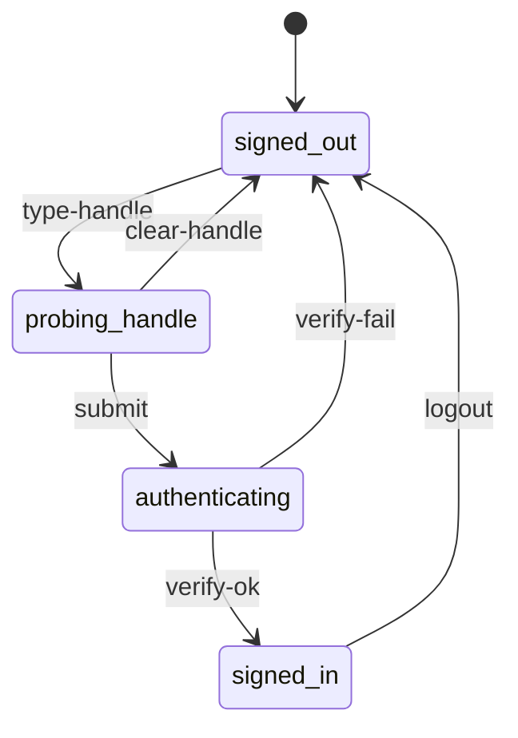
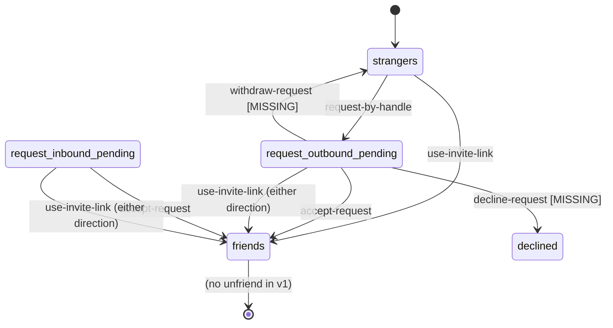
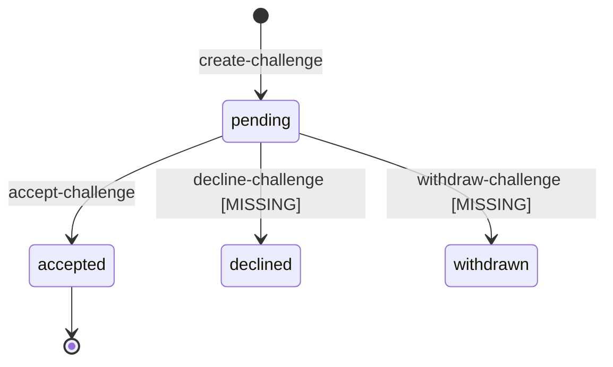
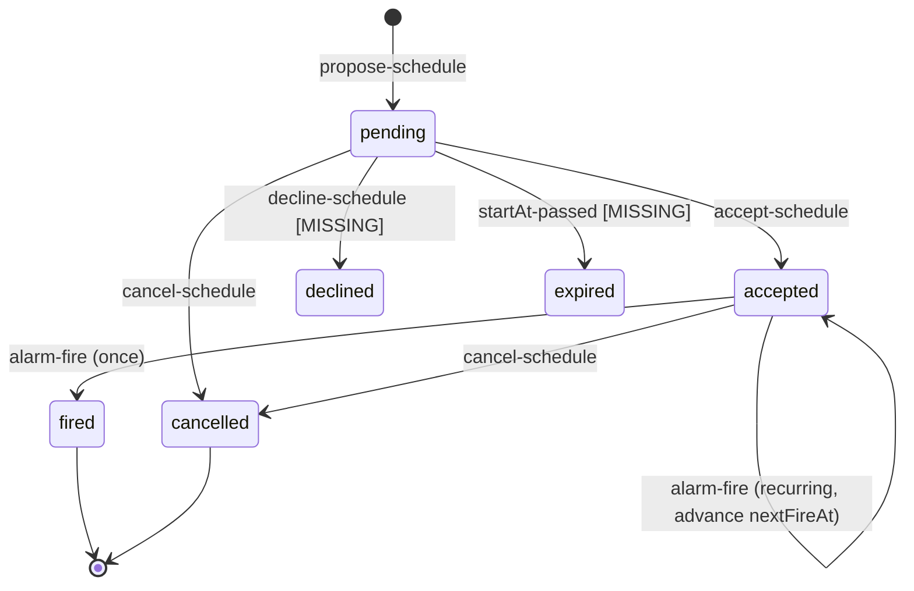
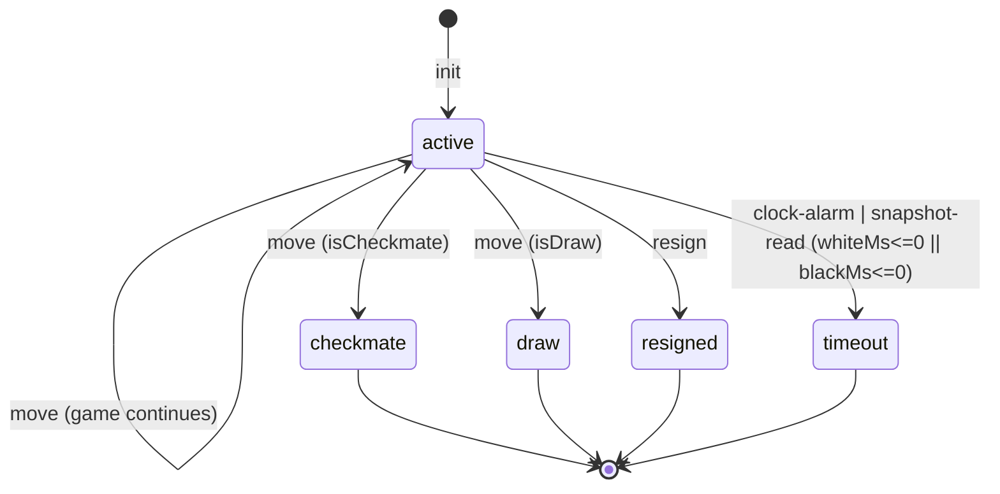
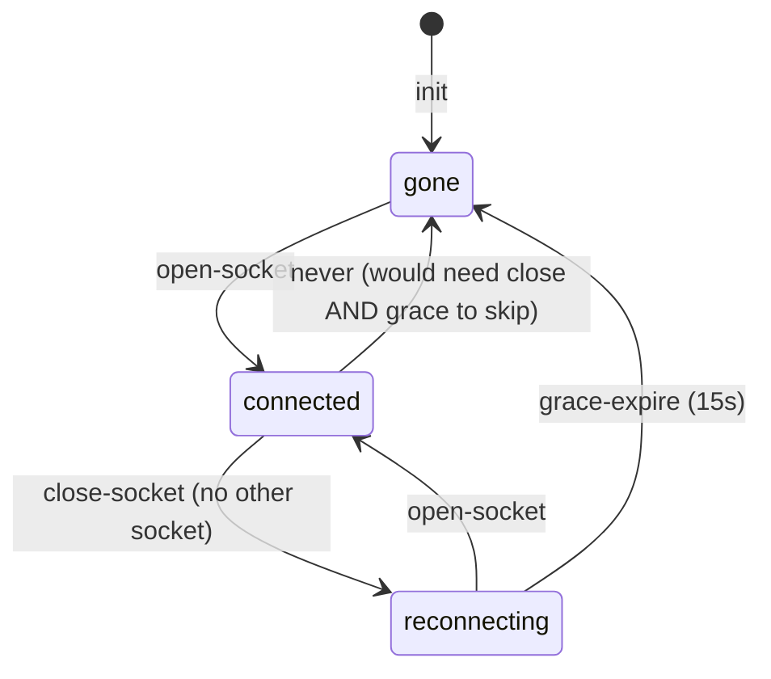
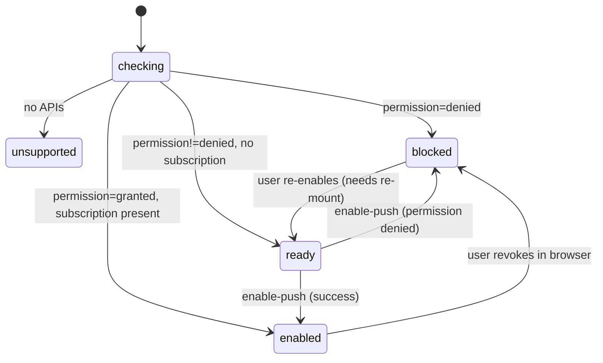

# two chairs — state machines (audit + model)

*Owner: the state-machine architect role. Any change to state, transitions,
guards, or single writers must land here in the same commit as the code that
introduces it. This file is what every future agent reads to know the shape
of the system before touching it.*

## Why this doc exists

The app grew feature by feature. Every feature that carried a lifecycle got a
status field, then another status field, then a boolean or two, and the UI
learned to filter over them. The result is what Tejas hit 2026-08-04: he
sent a game invite, went home, and the friend row still said `Invite`. The
row rendered against `friend.online` and nothing else — the outstanding
invitation had no representation. He could tap again and again. The system
was internally consistent (a second `Challenge` row was created and a second
push fired), just useless to the human on the other end.

That is what a missing state machine looks like: a lifecycle exists in the
data model, isn't projected to the surface, and the UI runs on scattered
flags instead of the state. Every fix that treats one symptom leaves the
next one to be reported. The rest of this document maps every lifecycle in
the app, names its single writer, and lists the states that are unrepresented
or unreachable so an implementing agent can close them one at a time.

## Vocabulary

- **State** — one of a finite, disjoint set of conditions an entity can be in.
  A machine is in exactly one state at a time. "Active with `winnerId` set"
  is not a state; it's a projection. `checkmate` is a state.
- **Event** — the thing that fires. HTTP request, alarm, WebSocket frame,
  timer, deploy. Events are named for what happened, not what should happen
  next.
- **Transition** — `(state, event) → state`, optionally with a guard. Every
  transition changes exactly one entity's state.
- **Guard** — the precondition that must hold for a transition to fire. If a
  guard fails, the event is rejected; the state doesn't change.
- **Single writer** — the one place in the system that is allowed to mutate
  the entity's state. Everyone else reads. On this codebase the writer is
  either `AppDO` (for account-scoped entities) or `GameDO` (for per-game
  state) — never the client.
- **Projection** — a client-side view derived from the writer's state.
  Projections are read-only. When they disagree with the writer, the writer
  wins on the next refresh.
- **Closure** — the guarantee that every state has an exit. A state you can
  enter but never leave is a defect regardless of how rare the entry.
- **Representation** — the UI shape a state takes. A state without a
  representation is a state the user can't act on. If two states share a
  representation, the UI can't tell them apart and neither can the user.

## Sources of truth

| Scope | Writer | Storage |
|---|---|---|
| Accounts, friendships, friend requests, challenges, schedules, game metadata, presence, push subscriptions, push log | `AppDO` (`ctx.storage.get("db")`) | Durable Object storage, single JSON blob keyed `"db"` |
| Per-game state (FEN, clocks, moves, terminal status, resign) | `GameDO` (`ctx.storage.get("game")`) | one DO per `gameId` |
| Per-game connection state (WebSocket presence of each player) | `GameDO` (in-memory `Map`, see GAP-13/14) | not persisted |
| Session token | `AppDO.sessions` | Durable Object storage |
| Push permission and subscription | browser (permission), `AppDO.pushSubscriptions[userId]` (up to 5) | browser + DO |
| Client `home` | derived from `/api/me` and `/api/presence/heartbeat` | React state, refreshed every 10s and after any action |

Cloudflare Durable Objects serialize request execution per DO. Within an
`AppDO` handler, or within a `GameDO` handler, there is no interleaving. That
is what lets us treat each DO as a lock-free single-writer without
transactional bookkeeping. It also means every rule below that says "the DO
is the writer" is enforceable — HTTP callers cannot mutate the DO's state
except through the routes the DO exposes.

## Machine inventory

1. Session / auth
2. Friendship (with `FriendRequest` as its own lifecycle)
3. Challenge (the game-invitation machine — the reported-bug machine)
4. Schedule
5. Game
6. Per-player game-connection state
7. Push subscription

Presence, the message toast, and the landing puzzle shelf carry state but
are not full machines — they are described in "Non-machines" at the end.

---

## Machine 1 — Session / auth

### Purpose
Establish which user is behind a request and let them sign out.

### States (per browser)

- `signed-out` — no session cookie, or the cookie doesn't resolve to a user.
- `probing-handle` — client is running the debounced login-options probe to
  learn whether the typed handle already has an account.
- `authenticating` — the browser is inside `startAuthentication` or
  `startRegistration`; a WebAuthn dialog is up.
- `signed-in` — session cookie resolves to a user; `AppDO.sessions[token]`
  holds that user's id.

The states after `signed-out` are transient client states (`AuthScreen`);
`signed-in` is durable and lives in the server session table plus the cookie.

### Events

- `type-handle` — the input changes. After 350ms debounce, fire
  `/api/auth/login/options`. `NoAccount` reply routes to `flow=register`;
  anything else routes to `flow=login`.
- `submit` — user activates the button. Runs `startAuthentication` or
  `startRegistration` depending on `flow`, then posts `/verify`.
- `verify-ok` — server issues a session cookie and returns the user.
- `verify-fail` — WebAuthn cancel, platform error, or server error. Falls
  back to the terminal-error matrix in `src/main.tsx:1998-2018`.
- `logout` — client posts `/api/auth/logout`; server deletes the session
  token and clears the cookie.

### Transitions

### Writer
`AppDO` for the session record. Client owns the ephemeral `flow` / `busy`
UI state; those are not authoritative.

### Representation
- `signed-out` — `AuthScreen`.
- `probing-handle` — button label morphs; row width reserved so nothing
  jumps.
- `authenticating` — button label is "Working…", `busy=true` disables
  submit.
- `signed-in` — `Dashboard`, `GameScreen`, or `WaitingRoom`.

### Closure
Every state has an explicit exit above. `authenticating` cannot deadlock —
the browser's WebAuthn API always resolves or rejects.

### Notes on soundness
- `AppDO.registrationChallenges` and `AppDO.authenticationChallenges` are
  written on `/options` and consumed on `/verify`. They are keyed by handle
  and by userId respectively, so a new `/options` call overwrites the prior
  one for the same key — no unbounded accumulation.
- There is no TTL cleanup for challenges that never get a `/verify`. A user
  who taps `/options`, walks away, and never comes back leaves one entry per
  handle. Bounded, low priority.

---

## Machine 2 — Friendship (and FriendRequest)

Two entities, one shared lifecycle. `Friendship` is the terminal state;
`FriendRequest` is the pending intermediate.

### States

**Pair-scoped** (viewed as the state of the pair `(A, B)`):

- `strangers` — no friend request in either direction, no friendship.
- `request-outbound-pending` — a `FriendRequest` from A to B, status
  `pending`.
- `request-inbound-pending` — same request viewed from B's side.
- `friends` — a `Friendship` row exists (id = `sorted(A,B).join(":")`).

**Entity-scoped** (viewed as the state of a single `FriendRequest`):

- `pending`
- `accepted`
- `declined`

### Events

- `request-by-handle` — `POST /api/friends/request` with a handle. Server
  creates a `FriendRequest` if none exists in either direction (dedupe in
  `createFriendRequest`, `src/worker.ts:752-773`).
- `use-invite-link` — `POST /api/friends/invite` with the target's
  `inviteToken`. The invite link IS standing consent; using it creates a
  `Friendship` immediately, skipping the request/accept ceremony. Any
  pending request in either direction is flipped to `accepted` in the same
  call. Idempotent (see `requestByInvite`, `src/worker.ts:702-750`).
- `accept-request` — recipient posts `/api/friends/:id/accept`. Status
  → `accepted`, Friendship row created.
- `decline-request` — **NO ENDPOINT EXISTS** (GAP-4).
- `withdraw-request` — **NO ENDPOINT EXISTS** (GAP-5).

### Transitions

Note: the entity-level `declined` state exists in the type
(`src/worker.ts:61`) but is unreachable — see GAP-4.

### Writer
`AppDO`. Reads: `/api/me` returns `friends`, `requests` (inbound pending),
`sentRequests` (outbound pending).

### Representation

- `strangers` — no row in Friends. Add-a-friend disclosure is where a user
  starts one.
- `request-inbound-pending` — row in `IncomingPanel` labeled `@x wants to
  be friends` with Accept. Present.
- `request-outbound-pending` — bullet in the Friends section header,
  labeled `Request sent to @x`. Present but read-only (no withdraw). See
  `src/main.tsx:2740-2746`.
- `friends` — row in the Friends list.

### Closure
- `strangers` — exitable via request-by-handle or invite link.
- `request-inbound-pending` — exitable via accept only. GAP-4 (no decline).
- `request-outbound-pending` — exitable only when the recipient accepts.
  GAP-5 (no withdraw). If the recipient never acts, the request sits
  forever.
- `friends` — terminal for v1 (no unfriend).

---

## Machine 3 — Challenge (game invitation)

**This is the reported-bug machine.** The state exists on the server; the
Friends row doesn't project it.

### States

- `pending` — challenge created by inviter, not yet acted on.
- `accepted` — recipient accepted; `gameId` is set; a Game exists and is
  `active`.
- `declined` — status value in the type (`src/worker.ts:76`), unreachable.

### Events

- `create-challenge` — `POST /api/challenges` with a friendId. Server
  creates a `Challenge` and enqueues a `challenge` push. Guard: users are
  friends (`assertFriends`). **NO GUARD against a pre-existing pending
  challenge in either direction** (GAP-3).
- `accept-challenge` — recipient posts `/api/challenges/:id/accept`. Server
  creates the Game (`createGame` → `GameDO.init`), sets challenge
  `status="accepted"`, sets `gameId`, and enqueues a `challenge_accepted`
  push to the inviter.
- `withdraw-challenge` — **NO ENDPOINT EXISTS** (GAP-2). Ledger promises
  "challenges persist on the server until answered OR WITHDRAWN"; the
  withdraw path was never built.
- `decline-challenge` — **NO ENDPOINT EXISTS** (GAP-2).
- `expire` — **DOES NOT EXIST**. Requirements say challenges have no TTL
  and that is the intended design; but combined with the missing withdraw,
  a challenge in `pending` has no exit other than accept.

### Transitions

### Writer
`AppDO`. Reads: `/api/me` returns `challenges` (inbound pending) and
`sentChallenges` (outbound pending). `/api/challenges/:id/state` returns a
single challenge for either party — this is the WaitingRoom's poll target.

### Representation (audit)

- **Inviter's home, before accept** — `home.sentChallenges` contains the
  pending challenge. It is **not projected to the Friends row**. The row
  renders against `friend.online` only; the Invite button is always active
  (`src/main.tsx:2748-2773`). This is the reported bug.
- **Inviter's home, after tapping Invite once** — sender is redirected to
  `/waiting/:id`. If they go Home from there, the pending challenge exists
  on the server, no dashboard surface acknowledges it.
- **Inviter's Waiting Room** — polls `/api/challenges/:id/state` every 2s;
  transitions to `/game/:gameId` when the status flips to `accepted`. This
  IS a representation of `pending` from the inviter's side, but only when
  the inviter stays on the URL.
- **Recipient's home** — `home.challenges` renders in `IncomingPanel` as
  `@x invited you to a game · 10 min` with Accept. Present.
- **Recipient's home, if inviter withdraws** — no representation because
  no withdraw event exists.
- **After accept** — inviter's push `challenge_accepted` links to the
  game; both parties end up in `/game/:id`. Accepted challenges disappear
  from both lists.

### Closure
- `pending` — exit only via accept. No withdraw, no decline, no expiry.
  A friend who declines by ignoring leaves the sender in the WaitingRoom
  polling forever.

### The bug in one line
The Friends row does not read `home.sentChallenges`, so `pending` has no
representation on the home surface for the inviter. Every state must have
a representation on every surface where the entity is user-relevant.

---

## Machine 4 — Schedule

Same shape as Challenge, plus a recurring branch and an alarm-driven fire
event. More states, more gaps.

### States

- `pending` — proposal by A, awaiting B.
- `accepted` — B accepted. For one-off, this is the pre-fire state; for
  recurring, this is the durable steady state.
- `fired` — one-off only: alarm fired and the game was created. Recurring
  schedules DO NOT enter `fired` — they stay `accepted` and roll `nextFireAt`
  forward.
- `cancelled` — either party ended the series (or the pending schedule).
- `declined` — value in the type (`src/worker.ts:105`), unreachable.

### Events

- `propose-schedule` — `POST /api/schedules`. Guards: friends, `startAt` in
  the future. `nextFireAt` is set to `startAt`. Recurrence coerced through
  `validateRecurrence`.
- `accept-schedule` — `POST /api/schedules/:id/accept`. Status → `accepted`,
  next alarm rearms.
- `cancel-schedule` — `POST /api/schedules/:id/cancel`. Either party.
  Idempotent (a second cancel is a no-op). Status → `cancelled`.
- `alarm-fire` — `AppDO.alarm()` runs on the next `nextFireAt`. For each
  accepted schedule with `nextFireAt <= now`: create a fresh Game, enqueue
  `scheduled_start` push to both parties. One-off → status `fired`.
  Recurring → advance `nextFireAt` by one interval, skip past occurrences
  without piling up games.
- `decline-schedule` — **NO ENDPOINT EXISTS** (GAP-6).
- `expire-pending` — **DOES NOT EXIST**. If Alice proposes 8pm and Bob
  never accepts, the schedule sits `pending` past 8pm forever (GAP-8).

### Transitions

### Writer
`AppDO`. `AppDO.alarm()` is the only place `nextFireAt` advances and
`status="fired"` is set. `setNextScheduleAlarm` rearms after every mutation.

### Representation

- `pending` — recipient sees an `IncomingPanel` row (`schedule.toId ===
  user.id && status === "pending"`); sender sees an outgoing schedule
  bullet in `PlaySection` with status "waiting". Both present.
- `accepted` — bullet in `PlaySection` with `formatScheduleWhen(...)` and
  status "confirmed". Recurring accepted schedules show an "End series"
  action. Present.
- `fired` — one-off only. Bullet remains, `Open` link to the created game.
  Present.
- `cancelled` — filtered out of `me()` by the recipient side (see
  `me()`'s schedules filter — actually it's `status !== "declined"`, so
  cancelled schedules stay visible; verify against `src/worker.ts:639`.
  As of this audit, cancelled ARE included in the list because the filter
  is `!== "declined"` only). Client shows status "cancelled" (see
  `scheduleStatus`). Acceptable but not great — cancelled schedules
  accumulate.
- `declined` — unreachable.

### Closure
- `pending` — exit via accept, cancel. No decline (GAP-6). No expiry after
  `startAt` (GAP-8) — becomes a zombie.
- `accepted` — one-off exits to `fired` on alarm; recurring exits to
  `cancelled` when either party ends the series. Both good.

---

## Machine 5 — Game

The best-defined machine in the app. States are disjoint, transitions have
clear guards, single writer is enforced by the per-game Durable Object.

### States

- `active` — clock running for whoever's turn it is.
- `checkmate` — `chess.isCheckmate()` returned true after a legal move.
  `winnerId`, `loserId`, `result` set.
- `draw` — `chess.isDraw()` returned true. `result = "1/2-1/2"`.
- `resigned` — a player POSTed `/resign`. `resignedBy`, `winnerId`,
  `loserId`, `result` set.
- `timeout` — `applyClock` observed a clock <= 0. Same fields as
  `resigned`.

### Events

- `init` — the AppDO POSTs `/init` with `x-internal: app` when the game is
  created. Idempotent: if a game already exists in the DO, `/init` is a
  no-op (`src/worker.ts:1013-1036`).
- `move` — `POST /move`. Guards: game is `active`, it is this user's turn,
  the move is legal per `chess.js`. Applies clock, applies move, checks
  checkmate/draw, rearms alarm if still active, reports terminal status
  to AppDO if not.
- `resign` — `POST /resign`. Guard: game is `active`. Sets terminal state
  in one atomic step.
- `clock-alarm` — DO alarm fires at the current mover's expiry. Runs
  `applyClock`; if a side ran out, sets `status="timeout"` and reports.
- `snapshot-read` — `GET /state` or any WebSocket read triggers
  `applyClock` before returning. This is what keeps the clock honest in
  the face of a missed alarm — the state is recomputed on read.

### Transitions

### Writer
`GameDO`. Move and resign endpoints both call `requirePlayer` which asserts
the caller is one of `whiteId`/`blackId`. AppDO holds a projection in
`db.games[id]` maintained by `/_internal/game-status` POSTs from the
GameDO.

### Representation
- `active` — Board renders; clocks tick; player-turn styling.
- Terminal states — `GameScreen` renders the terminal banner with result
  ("Checkmate — 1-0" etc.). Dashboard's `GameRow` shows `game.result` or
  the raw status word for non-active games. Live games list filters to
  `status === "active"`; past games list filters to the complement. Present.

### Closure
All terminal states are true terminals — no revert path. That's correct.

### Notes
- The `AppDO.games[id].status` field is a projection. GAP-11: if the POST
  from GameDO to AppDO fails, they diverge. There is no retry.
- `AppDO.games[id]` is read by `/api/me`; the Dashboard renders from it.
  The `In play` section will show a game as `active` even after it ended
  if the status POST was lost.

---

## Machine 6 — Per-player connection state (inside `GameDO`)

Two of these run per game — one per player. This is the closest the app
has to a live "presence" concept, and it lives in the `GameDO`, not
`AppDO`.

### States (per player, per game)

- `connected` — at least one open WebSocket for this user id.
- `reconnecting` — all sockets closed; within 15s grace.
- `gone` — no sockets, grace expired. Also the initial state at `init`.

### Events

- `open-socket` — `GET /socket` on the DO; sets state to `connected` and
  clears any pending grace timer.
- `close-socket` / `error-socket` — if no other socket for this user
  remains, set state to `reconnecting` and start a 15s `setTimeout` to
  promote to `gone`.
- `grace-expire` — the `setTimeout` fires; state becomes `gone`.
- `init` — sets both players to `gone`.

### Transitions

### Writer
`GameDO`, in memory. **Not persisted.**

### Representation
`GameScreen` renders `opponentRawState` via `presenceLabel(...)`. See
`src/main.tsx:3187,3244`. Not represented anywhere off the game screen.

### Closure
All three states are exitable — but see GAP-13 and GAP-14: the state is not
durable across DO hibernation, and the grace timer is a `setTimeout`, not
an alarm, so hibernation eats it.

---

## Machine 7 — Push subscription

Two-headed: browser permission and server subscription list. Client
projects the union into `PushStatus`.

### States (client-side `PushStatus`, see `src/main.tsx:1304, 2166`)

- `checking` — the effect is running for the first time.
- `unsupported` — browser lacks `Notification`, `serviceWorker`, or
  `PushManager`, or the server didn't provide `pushPublicKey`.
- `blocked` — browser `Notification.permission === "denied"`.
- `ready` — permission is `default` or `granted` but no subscription is
  registered with the SW.
- `enabled` — permission is `granted` AND a subscription exists on the SW.

### Events

- `mount` — `checkPushStatus()` reads the browser state, sets `PushStatus`.
- `enable-push` — user taps `Enable notifications`. Requests permission,
  subscribes via `pushManager.subscribe`, posts `/api/push/subscribe` to
  register the endpoint on the server (keeps most-recent 5 per user).
- `permission-change` — the browser can flip `denied` at any time; the
  client re-runs `checkPushStatus` on `home.pushPublicKey` change and on
  standalone-mode change.

### Transitions

### Writer
- Permission — browser only.
- Subscription — browser SW + `AppDO.pushSubscriptions[userId]`.

### Representation
`InstallPrompt` shows an install strip, an Enable button, or the blocked
recovery copy (`src/main.tsx:2241-2280`). Absent when `enabled`.

### Closure / soundness gap
- The server does not remove a subscription on `410 Gone` from the push
  gateway (`sendWebPush` logs but does not GC — see GAP-15). Server can
  hold dead endpoints indefinitely, up to five.

---

## Non-machines (worth naming so nobody treats them as machines)

- **Presence dot on Friends list.** Derived value: `now -
  db.presence[friend.id] < 30000`. Not a state machine, a debounced
  boolean. The 30s window is a projection of "the heartbeat happened
  recently"; no transitions, no writer beyond the heartbeat endpoint. It
  is deliberately a rendering rule, not a lifecycle.
- **Toast / message.** Single-slot notification with a 4s auto-dismiss
  timer. Overflow strategy is "last write wins". Fine as a UI primitive;
  don't overload it with lifecycle semantics.
- **Landing puzzle shelf.** Has a walk animation between positions and
  a stuck-piece wobble. The transition uses `animating: boolean` as an
  interlock. The ownership discipline documented at
  `src/main.tsx:96-116` (React owns the outer wrapper; the pieces layer
  is imperative-only, single writer under `piecesLayerRef`) is the right
  pattern for the rest of the app to imitate. That comment IS the missing
  rulebook, applied to one component.

---

## Gaps — ranked by user impact

### GAP-1 (P0): Challenge `pending` has no representation on the Friends row
**Where:** `src/main.tsx:2748-2773` (`FriendsSection` friend row).
**What:** Row reads `friend.online` only. The Invite button is always
active. `home.sentChallenges` is not consulted per-friend.
**User impact:** The reported bug. The inviter has no sense of "invitation
outstanding to Bob", can spam Invite, and each tap fires another push
(compounded by GAP-3 below).
**Fix (minimal):** Compute `outbound = home.sentChallenges.find(c =>
c.toId === friend.id)` in the row. If present, render a row that says
"Invited @bob · waiting" with an Open action that navigates to
`/waiting/${outbound.id}` and a Withdraw action (see GAP-2). Suppress the
Invite button while outbound is pending.

### GAP-2 (P0): Challenge `pending` has no exit other than accept
**Where:** `src/worker.ts` — no `/withdraw`, no `/decline`, no expiry.
Ledger claims withdrawal exists.
**User impact:** Accidental invite lives forever. Recipient has to accept
or ignore. Sender can never say "never mind".
**Fix:** Add `POST /api/challenges/:id/withdraw` (guard: `fromId ===
user.id`, `status === "pending"`) → `status = "withdrawn"`. Add `POST
/api/challenges/:id/decline` (guard: `toId === user.id`, `status ===
"pending"`) → `status = "declined"`. Both are idempotent: repeating them
is a no-op success. Update the `Challenge` type union accordingly. In the
WaitingRoom, when the poll returns `status === "declined"` or
`"withdrawn"`, transition to a terminal-message screen with a Home action.

### GAP-3 (P0): `create-challenge` is not idempotent per (fromId, toId)
**Where:** `src/worker.ts:789-807` (`createChallenge`).
**What:** No dedupe. Second tap creates a second `Challenge` and enqueues
a second push.
**User impact:** Same as GAP-1 — spammable.
**Fix:** Before creating, check for an existing pending challenge in either
direction between (user.id, target.id). If pending outbound exists, return
that one (no new push). If pending inbound exists (target invited user
first), return an error the client can turn into "@x already invited you
— accept theirs instead". This mirrors the friend-request dedupe already
present at `createFriendRequest` (`src/worker.ts:755-760`).

### GAP-4 (P1): FriendRequest `pending` has no decline
**Where:** `src/worker.ts:61` declares `declined`; no endpoint sets it.
**User impact:** Recipient can only accept or ignore. Sender's
`sentRequests` never clears if the recipient doesn't want to be friends.
**Fix:** Add `POST /api/friends/:id/decline` (guard: `toId === user.id`,
`status === "pending"`). Recipient's `IncomingPanel` row gets a small
Dismiss action.

### GAP-5 (P1): FriendRequest `pending` has no withdrawal
**Where:** `src/worker.ts`.
**User impact:** Sender who mistypes a handle or changes their mind has
no way out.
**Fix:** Add `DELETE /api/friends/requests/:id` (guard: `fromId ===
user.id`, `status === "pending"`) → mark declined (or delete the row).
Sender's Friends section header adds a tiny Withdraw action next to the
`Request sent to @x` bullet.

### GAP-6 (P2): Schedule `declined` state is unreachable
**Where:** `src/worker.ts:105` declares `declined`; no endpoint sets it.
**Fix:** Either add `POST /api/schedules/:id/decline` (guard: `toId ===
user.id`, `status === "pending"`) or delete `declined` from the type.
Preference: add the endpoint; the recipient of an unwanted proposal needs
a way to say no beyond ignoring.

### GAP-7 (P2): Schedule pending past `startAt` becomes a zombie
**Where:** `AppDO.alarm()` only touches `status === "accepted"`.
**What:** If B never accepts and `startAt` passes, the schedule sits
`pending` forever. It clutters both parties' lists and can never fire.
**Fix:** In `alarm()`, sweep `status === "pending"` schedules where
`startAt < now - grace`. Options: mark them `expired` (new terminal), or
delete them. Prefer `expired` so the record survives for the requester's
mental model. Requires rearming the alarm to catch these too — pending
schedules should contribute their `startAt` to the next-alarm calculation.

### GAP-8 (P2): GameDO `connectionState` is not persisted
**Where:** `src/worker.ts:979` (`private connectionState: Record<...> =
{};`).
**What:** In-memory map. Cloudflare hibernates idle DOs; on next request,
the map is empty and both players are treated as `gone` (per the `init`
seed, which only runs once).
**User impact:** Rare in a live game where the socket keeps the DO warm,
but the moment the last socket closes and the DO hibernates, the state is
gone. On next open, the presence dot lies until sockets reattach.
**Fix:** Either persist `connectionState` in storage on each transition,
or drop the field entirely and derive at snapshot time from `this.clients`
plus a `lastSeenAt` timestamp stored per player.

### GAP-9 (P2): GameDO reconnect grace uses `setTimeout`
**Where:** `src/worker.ts:1149-1156`.
**What:** `setTimeout` in a DO does not survive hibernation. If the DO
hibernates during the 15s grace, the promotion to `gone` never fires;
`connectionState[userId]` stays `reconnecting` until the next event forces
a snapshot.
**Fix:** Store a `graceExpiresAt[userId]` timestamp on disconnect. At
every snapshot, promote to `gone` if `graceExpiresAt <= now`. Optionally
schedule an alarm at the nearest `graceExpiresAt` so a fresh snapshot
happens on schedule.

### GAP-10 (P2): AppDO `games[id]` projection can drift from GameDO
**Where:** `src/worker.ts:1220-1227` (`reportStatus`) and
`src/worker.ts:957-966` (`updateGameStatus`).
**What:** `GameDO.reportStatus` is fire-and-forget. If the AppDO fetch
fails (transient error, deploy, etc.), the AppDO's `games[id].status`
stays `active` after the underlying game has ended.
**User impact:** Dashboard shows a finished game in the `In play` section
until the user opens it (which triggers a fresh snapshot).
**Fix:** Retry with backoff (idempotent write on the AppDO side already —
setting the same status twice is fine). Or: `/api/me` could opportunistically
fetch each active game's state from its `GameDO` and reconcile — but that
scales badly per user. The retry is the cheaper fix.

### GAP-11 (P2): GameDO doesn't use hibernatable WebSockets
**Where:** `src/worker.ts:1044-1046` uses raw `WebSocketPair` + `accept()`,
not `state.acceptWebSocket(server)`.
**What:** Non-hibernatable sockets keep the DO warm as long as they're
open, which is fine while both players are connected but expensive when
one side idles. More importantly, `this.clients` is a `Map` — it's
in-memory. If the DO is evicted while sockets are open (shouldn't happen
with non-hibernatable, but any restart), the map is empty. Combined with
GAP-8, this compounds.
**Fix:** Migrate to `state.acceptWebSocket()` + attachment tags for
per-connection metadata (userId, handle). Cloudflare's docs cover this;
it also cuts bill.

### GAP-12 (P3): Server holds dead push endpoints
**Where:** `src/worker.ts:339-358` (`sendWebPush`).
**What:** On `410 Gone` (subscription revoked in browser), the server logs
`delivered: false` but keeps the endpoint. Next push tries it again.
**Fix:** On `410 Gone` (or any 4xx explicitly meaning "endpoint is dead"),
remove the endpoint from `db.pushSubscriptions[userId]` in the same
transaction as the log write.

### GAP-13 (P3): Auth challenges never GC'd
**Where:** `src/worker.ts:499, 560` — writes; no cleanup.
**What:** `registrationChallenges[handle]` and
`authenticationChallenges[user.id]` are overwritten on each new
`/options`, so accumulation is bounded to (# distinct handles ever
probed + # users). Not urgent, but the record has a `createdAt` and
should have a TTL sweep.
**Fix:** Alarm-driven sweep, or lazy delete in `verify` for anything past
some age.

### GAP-14 (P3): WaitingRoom has no branch for a declined / withdrawn
challenge
**Where:** `src/main.tsx:2900-2924`.
**What:** The poll blindly re-polls unless `status === "accepted"`. Once
GAP-2 lands (declined / withdrawn become reachable), the poll will spin
forever.
**Fix:** In the poll response handler, on `status === "declined"` show a
terminal message ("@x can't right now"), on `status === "withdrawn"` show
a self-recovery message ("You cancelled this invite"), both with a Home
action. Do this in the same change as GAP-2 so the state machine and its
representation ship together.

### GAP-15 (P4): The name of the entity in `sentRequests` UI is wrong
**Where:** `src/main.tsx:2740-2746`.
**What:** `home.sentRequests` bullet says "Request sent to @x". That's a
`FriendRequest`, not a challenge — the label is correct. Noting here only
so the future agent doesn't confuse the two entities: `sentRequests` is
friend requests; `sentChallenges` is game invitations.

---

## What to fix first

If exactly one change lands, GAP-1 alone closes the reported bug: the
Friends row reads `home.sentChallenges`, projects the pending-invitation
state, and offers Open + Withdraw. That change wants GAP-2 (a withdraw
endpoint to call) and GAP-3 (server-side dedupe so the second tap is
harmless while the client catches up) in the same round. Together those
three are the minimum that makes the invitation lifecycle observable and
reversible from the surface where the user starts and ends up.

Everything below GAP-3 is real but the app functions without it.
`stateful-shapes` (the skill of the same name in this workspace) is a
useful complementary read when picking up any of the P2s.
