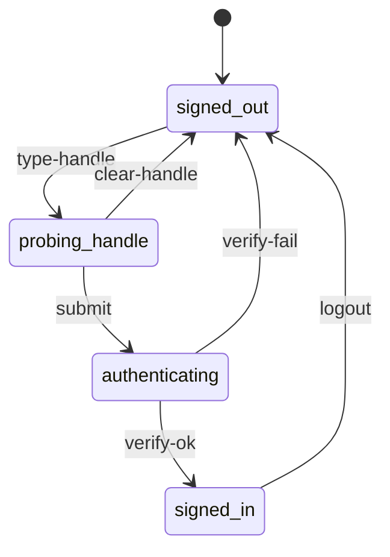
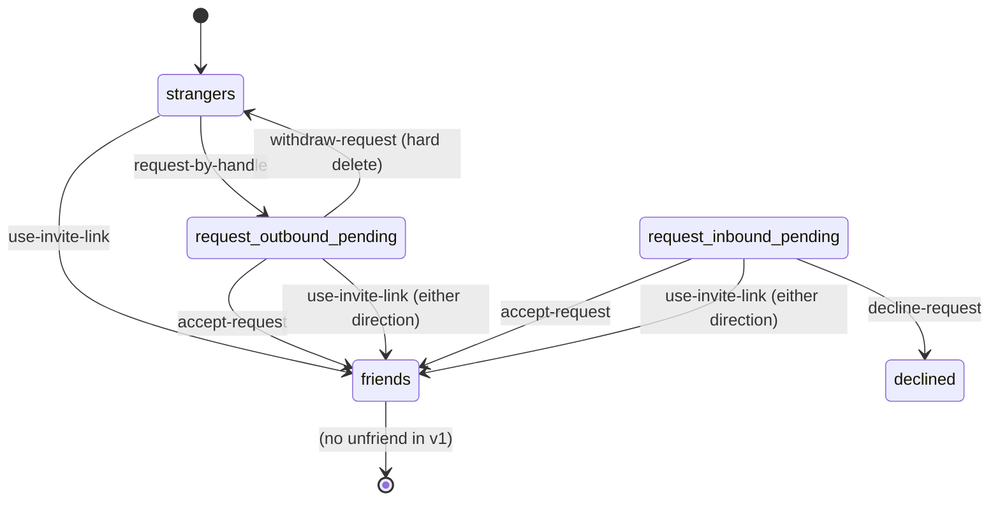
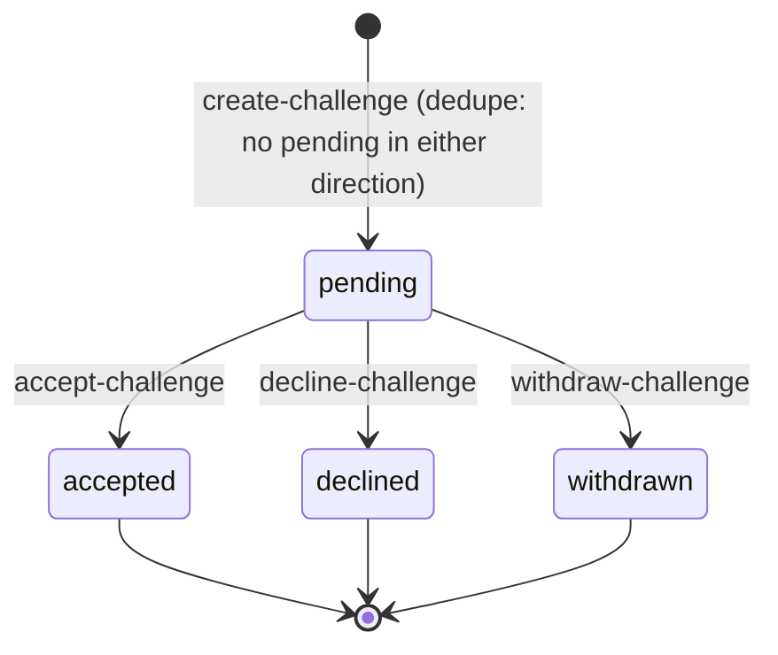
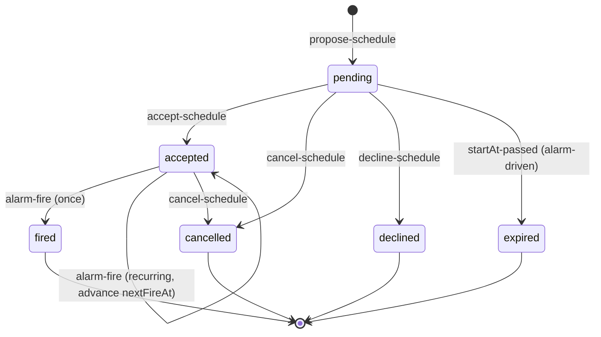
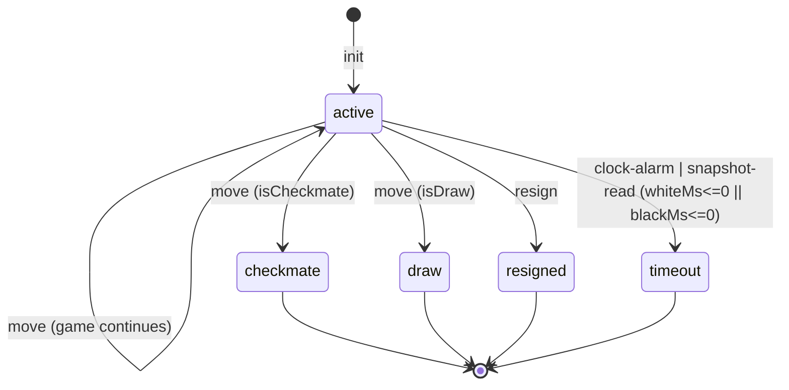
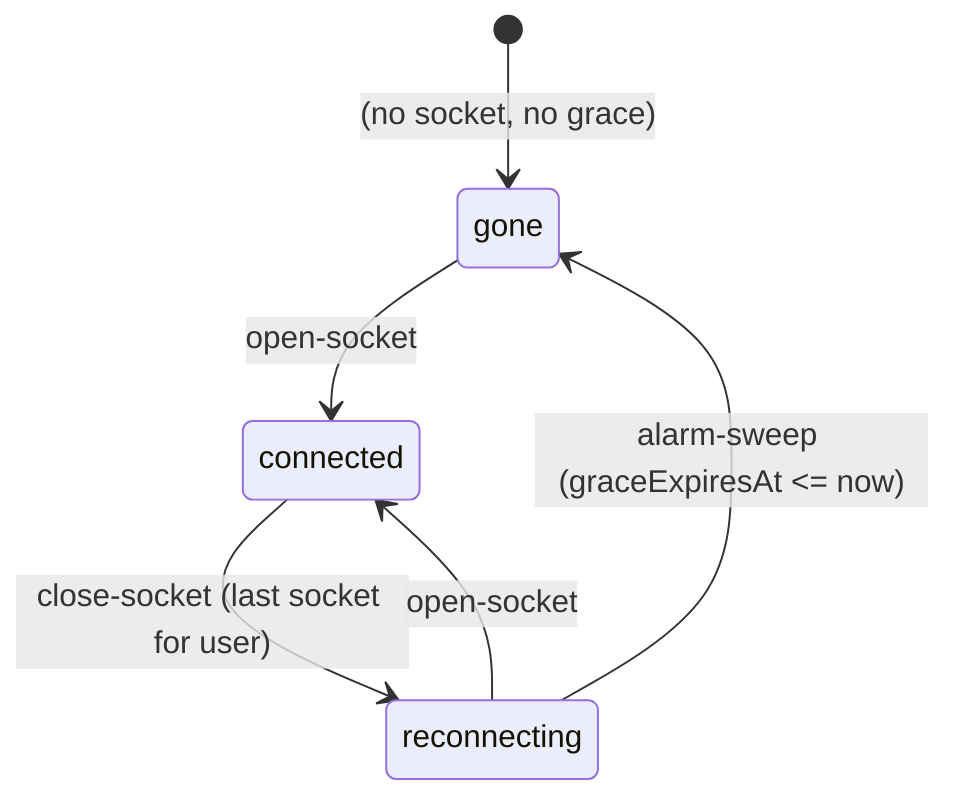
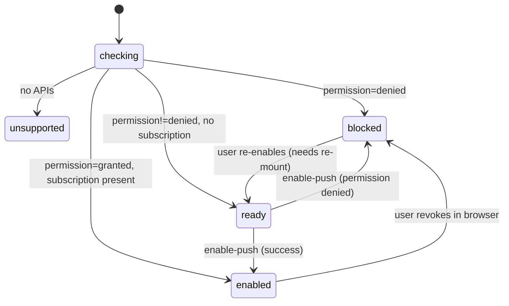

# two chairs — state machines (audit + model)

*Owner: the state-machine architect role. Any change to state, transitions,
guards, or single writers must land here in the same commit as the code that
introduces it. This file is what every future agent reads to know the shape
of the system before touching it.*

## Status log

GAP-N identifiers are stable — do not renumber. Commit messages and test
names cite them (`state-smith GAP-N`). New gaps found in the audit are
appended at the next unused number.

- **c7bc407** (2026-08-04) — initial audit committed.
- **7878939** (post c7bc407) — GAP-2 (challenge withdraw + decline
  endpoints), GAP-3 (create-challenge dedupe in either direction), GAP-14
  (WaitingRoom terminals for withdrawn / declined) closed. Also closes
  GAP-1 on the surface: the Friends row now projects `sentChallenges` /
  `challenges` / accepted `schedules` and renders `Invited` / `Accept` /
  `Scheduled` in place of the unconditional `Invite` button, and the
  Dashboard's `In play` section carries a `WaitingRow` per outgoing
  pending challenge with a Withdraw action.
- **9b084a2** (2026-08-05) — GAP-4 (friend-request decline), GAP-5
  (friend-request withdraw as hard delete), GAP-6 (schedule decline),
  GAP-7 (schedule zombie sweep to `expired` with 60s grace), GAP-15
  (sentRequests label clarified to `Friend request sent to @x`) closed.
- **8d7023e** — TIER B closed. GAP-8 (persisted connection state,
  reframed as *derived*), GAP-9 (alarm-driven grace, no `setTimeout`),
  GAP-10 (retry `reportStatus` with backoff via `waitUntil`), GAP-11
  (hibernatable WebSockets via `ctx.acceptWebSocket`), GAP-12 (drop
  dead push endpoints on 410/404), GAP-13 (lazy TTL sweep of auth
  challenges, 10 min cutoff), GAP-16 (time-warp harness via `POST
  /_debug/tick`).

Remaining: GAP-16-follow-up — a time-warp regression that ticks a
recurring accepted schedule multiple times, proving `nextFireAt`
advances by exactly one interval per tick without piling up games. The
existing real-time test only covers a single firing.

## Why this doc exists

The app grew feature by feature. Every feature that carried a lifecycle got a
status field, then another status field, then a boolean or two, and the UI
learned to filter over them. The result is what Tejas hit 2026-08-04: he
sent a game invite, went home, and the friend row still said `Invite`. The
row rendered against `friend.online` and nothing else — the outstanding
invitation had no representation. He could tap again and again. The system
was internally consistent (a second `Challenge` row was created and a second
push fired), just useless to the human on the other end.

That is what a missing state machine looks like: a lifecycle exists in the
data model, isn't projected to the surface, and the UI runs on scattered
flags instead of the state. Every fix that treats one symptom leaves the
next one to be reported. The rest of this document maps every lifecycle in
the app, names its single writer, and lists the states that are unrepresented
or unreachable so an implementing agent can close them one at a time.

## Vocabulary

- **State** — one of a finite, disjoint set of conditions an entity can be in.
  A machine is in exactly one state at a time. "Active with `winnerId` set"
  is not a state; it's a projection. `checkmate` is a state.
- **Event** — the thing that fires. HTTP request, alarm, WebSocket frame,
  timer, deploy. Events are named for what happened, not what should happen
  next.
- **Transition** — `(state, event) → state`, optionally with a guard. Every
  transition changes exactly one entity's state.
- **Guard** — the precondition that must hold for a transition to fire. If a
  guard fails, the event is rejected; the state doesn't change.
- **Single writer** — the one place in the system that is allowed to mutate
  the entity's state. Everyone else reads. On this codebase the writer is
  either `AppDO` (for account-scoped entities) or `GameDO` (for per-game
  state) — never the client.
- **Projection** — a client-side view derived from the writer's state.
  Projections are read-only. When they disagree with the writer, the writer
  wins on the next refresh.
- **Closure** — the guarantee that every state has an exit. A state you can
  enter but never leave is a defect regardless of how rare the entry.
- **Representation** — the UI shape a state takes. A state without a
  representation is a state the user can't act on. If two states share a
  representation, the UI can't tell them apart and neither can the user.

## Sources of truth

| Scope | Writer | Storage |
|---|---|---|
| Accounts, friendships, friend requests, challenges, schedules, game metadata, presence, push subscriptions, push log | `AppDO` (`ctx.storage.get("db")`) | Durable Object storage, single JSON blob keyed `"db"` |
| Per-game state (FEN, clocks, moves, terminal status, resign) | `GameDO` (`ctx.storage.get("game")`) | one DO per `gameId` |
| Per-game connection state (WebSocket presence of each player) | `GameDO` (in-memory `Map`, see GAP-13/14) | not persisted |
| Session token | `AppDO.sessions` | Durable Object storage |
| Push permission and subscription | browser (permission), `AppDO.pushSubscriptions[userId]` (up to 5) | browser + DO |
| Client `home` | derived from `/api/me` and `/api/presence/heartbeat` | React state, refreshed every 10s and after any action |

Cloudflare Durable Objects serialize request execution per DO. Within an
`AppDO` handler, or within a `GameDO` handler, there is no interleaving. That
is what lets us treat each DO as a lock-free single-writer without
transactional bookkeeping. It also means every rule below that says "the DO
is the writer" is enforceable — HTTP callers cannot mutate the DO's state
except through the routes the DO exposes.

## Machine inventory

1. Session / auth
2. Friendship (with `FriendRequest` as its own lifecycle)
3. Challenge (the game-invitation machine — the reported-bug machine)
4. Schedule
5. Game
6. Per-player game-connection state
7. Push subscription

Presence, the message toast, and the landing puzzle shelf carry state but
are not full machines — they are described in "Non-machines" at the end.

---

## Machine 1 — Session / auth

### Purpose
Establish which user is behind a request and let them sign out.

### States (per browser)

- `signed-out` — no session cookie, or the cookie doesn't resolve to a user.
- `probing-handle` — client is running the debounced login-options probe to
  learn whether the typed handle already has an account.
- `authenticating` — the browser is inside `startAuthentication` or
  `startRegistration`; a WebAuthn dialog is up.
- `signed-in` — session cookie resolves to a user; `AppDO.sessions[token]`
  holds that user's id.

The states after `signed-out` are transient client states (`AuthScreen`);
`signed-in` is durable and lives in the server session table plus the cookie.

### Events

- `type-handle` — the input changes. After 350ms debounce, fire
  `/api/auth/login/options`. `NoAccount` reply routes to `flow=register`;
  anything else routes to `flow=login`.
- `submit` — user activates the button. Runs `startAuthentication` or
  `startRegistration` depending on `flow`, then posts `/verify`.
- `verify-ok` — server issues a session cookie and returns the user.
- `verify-fail` — WebAuthn cancel, platform error, or server error. Falls
  back to the terminal-error matrix in `src/main.tsx:1998-2018`.
- `logout` — client posts `/api/auth/logout`; server deletes the session
  token and clears the cookie.

### Transitions

### Writer
`AppDO` for the session record. Client owns the ephemeral `flow` / `busy`
UI state; those are not authoritative.

### Representation
- `signed-out` — `AuthScreen`.
- `probing-handle` — button label morphs; row width reserved so nothing
  jumps.
- `authenticating` — button label is "Working…", `busy=true` disables
  submit.
- `signed-in` — `Dashboard`, `GameScreen`, or `WaitingRoom`.

### Closure
Every state has an explicit exit above. `authenticating` cannot deadlock —
the browser's WebAuthn API always resolves or rejects.

### Notes on soundness
- `AppDO.registrationChallenges` and `AppDO.authenticationChallenges` are
  written on `/options` and consumed on `/verify`. They are keyed by handle
  and by userId respectively, so a new `/options` call overwrites the prior
  one for the same key — no unbounded accumulation.
- There is no TTL cleanup for challenges that never get a `/verify`. A user
  who taps `/options`, walks away, and never comes back leaves one entry per
  handle. Bounded, low priority.

---

## Machine 2 — Friendship (and FriendRequest)

Two entities, one shared lifecycle. `Friendship` is the terminal state;
`FriendRequest` is the pending intermediate.

### States

**Pair-scoped** (viewed as the state of the pair `(A, B)`):

- `strangers` — no friend request in either direction, no friendship.
- `request-outbound-pending` — a `FriendRequest` from A to B, status
  `pending`.
- `request-inbound-pending` — same request viewed from B's side.
- `friends` — a `Friendship` row exists (id = `sorted(A,B).join(":")`).

**Entity-scoped** (viewed as the state of a single `FriendRequest`):

- `pending`
- `accepted`
- `declined`

### Events

- `request-by-handle` — `POST /api/friends/request` with a handle. Server
  creates a `FriendRequest` if none exists in either direction (dedupe in
  `createFriendRequest`, `src/worker.ts:752-773`).
- `use-invite-link` — `POST /api/friends/invite` with the target's
  `inviteToken`. The invite link IS standing consent; using it creates a
  `Friendship` immediately, skipping the request/accept ceremony. Any
  pending request in either direction is flipped to `accepted` in the same
  call. Idempotent (see `requestByInvite`, `src/worker.ts:702-750`).
- `accept-request` — recipient posts `/api/friends/:id/accept`. Status
  → `accepted`, Friendship row created.
- `decline-request` — recipient posts `/api/friends/:id/decline`
  (`declineFriendRequest`, `src/worker.ts:842`). Guards: `toId ===
  user.id`, `status === "pending"`. Idempotent — decline of an
  already-declined / accepted / withdrawn request returns the current
  status without error. Status → `declined`.
- `withdraw-request` — sender posts `DELETE
  /api/friends/requests/:id` (`withdrawFriendRequest`,
  `src/worker.ts:861`). Guard: `fromId === user.id`. **Hard delete** of
  the row rather than a `withdrawn` terminal, chosen because a sender
  who took the request back has no dedicated waiting surface to display
  the outcome on (contrast the challenge machine, where the WaitingRoom
  needs a terminal to render). Idempotent: missing row returns
  `status: "gone"`, non-pending returns the current status.

### Transitions

The entity-level `declined` state (`src/worker.ts:61`) is now reachable
via `decline-request`. The sender does not observe a per-request
`declined` — from the sender's side, `sentRequests` simply stops
returning the row (declined requests are filtered out of `sentRequests`
in `me()`).

### Writer
`AppDO`. Reads: `/api/me` returns `friends`, `requests` (inbound pending),
`sentRequests` (outbound pending).

### Representation

- `strangers` — no row in Friends. Add-a-friend disclosure is where a user
  starts one.
- `request-inbound-pending` — row in `IncomingPanel` labeled `@x wants to
  be friends` with primary Accept and a quiet Decline text link.
- `request-outbound-pending` — bullet in `FriendsSection`, labeled
  `Friend request sent to @x` (GAP-15) with a quiet Withdraw link
  (vermillion on hover). See the `withdrawFriendRequest` handler at
  `src/main.tsx:2833`.
- `friends` — row in the Friends list.

### Closure
- `strangers` — exitable via request-by-handle or invite link.
- `request-inbound-pending` — exitable via accept OR decline. Both paths
  live.
- `request-outbound-pending` — exitable via recipient accept OR sender
  withdraw. Both paths live. If neither party acts, the request sits, but
  either side can end it.
- `friends` — terminal for v1 (no unfriend).

---

## Machine 3 — Challenge (game invitation)

**This is the reported-bug machine.** The state exists on the server; the
Friends row doesn't project it.

### States

- `pending` — challenge created by inviter, not yet acted on.
- `accepted` — recipient accepted; `gameId` is set; a Game exists and is
  `active`.
- `declined` — recipient explicitly said no.
- `withdrawn` — inviter cancelled.

### Events

- `create-challenge` — `POST /api/challenges` with a friendId. Guards:
  users are friends (`assertFriends`); no pending challenge exists in
  either direction (dedupe added in commit 7878939 — outbound duplicate
  returns the existing pending row; inbound duplicate errors so the UI
  can steer the user to accept the pending inbound one instead). Fires a
  `challenge` push only when a fresh row is created.
- `accept-challenge` — recipient posts `/api/challenges/:id/accept`.
  Server creates the Game (`createGame` → `GameDO.init`), sets challenge
  `status="accepted"`, sets `gameId`, and enqueues a
  `challenge_accepted` push to the inviter.
- `withdraw-challenge` — inviter posts
  `POST /api/challenges/:id/withdraw` (`withdrawChallenge`,
  `src/worker.ts:911`). Guard: `fromId === user.id`, `status ===
  "pending"`. Idempotent. Sets `status = "withdrawn"`.
- `decline-challenge` — recipient posts
  `POST /api/challenges/:id/decline` (`declineChallenge`,
  `src/worker.ts:930`). Guard: `toId === user.id`, `status ===
  "pending"`. Idempotent. Sets `status = "declined"`.
- `expire` — deliberately not implemented. Challenges persist until one
  of the four transitions fires (accept / decline / withdraw). This is
  the intended design per the ledger.

### Transitions

### Writer
`AppDO`. Reads: `/api/me` returns `challenges` (inbound pending) and
`sentChallenges` (outbound pending). `/api/challenges/:id/state` returns a
single challenge for either party — this is the WaitingRoom's poll target.

### Representation

- **Inviter's home** — `home.sentChallenges` filtered to `status ===
  "pending"` is projected to two surfaces. First, the Friends row for
  the invitee renders a ghost `Invited` button that opens the waiting
  room (`src/main.tsx:2978-2991`). Second, the Dashboard's `In play`
  section carries a `WaitingRow` per pending outbound challenge with a
  Withdraw action (`src/main.tsx:2514, 2521`).
- **Inviter's Waiting Room** — polls `/api/challenges/:id/state` every
  2s. Terminals:
  - `status === "accepted"` → navigate to `/game/:gameId`.
  - `status === "declined"` or `"withdrawn"` → stop the poll and render
    a terminal message with a Home action
    (`src/main.tsx:3127, 3204`).
- **Recipient's home** — `home.challenges` renders in `IncomingPanel` as
  `@x invited you to a game · 10 min` with primary Accept and a quiet
  Decline text link (`declineChallenge` handler, `src/main.tsx:2409`).
  The Friends row for the inviter also gets an inline Accept button
  (`src/main.tsx:2967-2976`) so the recipient can accept without
  scrolling to the IncomingPanel.
- **Recipient's home, if inviter withdraws** — the challenge is no
  longer in `home.challenges` (server filters non-pending out of the
  invited-user list), so the row simply disappears on next refresh.
  Acceptable because the recipient never took action.
- **After accept** — inviter's push `challenge_accepted` links to the
  game; both parties end up in `/game/:id`. Accepted challenges
  disappear from both lists.

### Closure
- `pending` — three exits: accept, decline, withdraw. All idempotent.
- `accepted` / `declined` / `withdrawn` — terminals.

### The originally reported bug
Closed in commit 7878939. The Friends row now reads `home.sentChallenges`
and renders `Invited` in place of `Invite` when an outbound pending
challenge exists to that friend, and the Dashboard's `In play` section
surfaces a `WaitingRow` with a Withdraw action for the sender.

---

## Machine 4 — Schedule

Same shape as Challenge, plus a recurring branch and an alarm-driven fire
event. More states, more gaps.

### States

- `pending` — proposal by A, awaiting B.
- `accepted` — B accepted. For one-off, this is the pre-fire state; for
  recurring, this is the durable steady state.
- `fired` — one-off only: alarm fired and the game was created. Recurring
  schedules DO NOT enter `fired` — they stay `accepted` and roll `nextFireAt`
  forward.
- `cancelled` — either party ended the series (or the pending schedule).
- `declined` — recipient said no while status was pending.
- `expired` — pending schedule whose `startAt + grace` passed without an
  accept. Alarm-driven terminal.

### Events

- `propose-schedule` — `POST /api/schedules`. Guards: friends, `startAt` in
  the future. `nextFireAt` is set to `startAt`. Recurrence coerced through
  `validateRecurrence`.
- `accept-schedule` — `POST /api/schedules/:id/accept`. Status → `accepted`,
  next alarm rearms.
- `cancel-schedule` — `POST /api/schedules/:id/cancel`. Either party.
  Idempotent (a second cancel is a no-op). Status → `cancelled`.
- `decline-schedule` — recipient posts `POST /api/schedules/:id/decline`
  (`declineSchedule`, near `cancelSchedule` in `src/worker.ts`). Guards:
  `toId === user.id`, `status === "pending"`. Idempotent. Sets `status =
  "declined"` and calls `setNextScheduleAlarm()` to rearm the sweep.
- `alarm-fire` — `AppDO.alarm()` runs on the next scheduled time. Two
  passes per wake:
  1. **Zombie sweep** (`src/worker.ts:454-466`): every `status ===
     "pending"` schedule with `startAt + 60_000ms <= now` is transitioned
     to `expired`. The 60s grace matches the create-endpoint tolerance
     so an accept landing seconds before `startAt` isn't racy with the
     sweep.
  2. **Fire loop**: every `status === "accepted"` schedule with
     `nextFireAt <= now` creates one fresh Game and enqueues
     `scheduled_start` pushes to both parties. One-off → `fired`.
     Recurring → advance `nextFireAt` by one interval, skipping past
     occurrences so a missed week doesn't fire a stack of catch-up
     games.
- `startAt-passed` — the zombie-sweep half of `alarm-fire` above.
- Alarm rearming: `setNextScheduleAlarm()` now considers two wake
  targets and takes the earlier: (a) accepted schedules' `nextFireAt`,
  (b) pending schedules' `startAt + grace`. See `src/worker.ts:1108`.

### Transitions

### Writer
`AppDO`. `AppDO.alarm()` is the only place `nextFireAt` advances and
`status="fired"` is set. `setNextScheduleAlarm` rearms after every mutation.

### Representation

- `pending` — recipient sees an `IncomingPanel` row (`schedule.toId ===
  user.id && status === "pending"`) with primary Accept and a quiet
  Decline text link; sender sees an outgoing schedule bullet in
  `PlaySection` with status "waiting".
- `accepted` — bullet in `PlaySection` with `formatScheduleWhen(...)`
  and status "confirmed". Recurring accepted schedules show an "End
  series" action. The Friends row for the paired friend also renders a
  disabled `Scheduled` button so the same-friend surface reflects the
  standing agreement (`src/main.tsx:2992-3005`).
- `fired` — one-off only. Bullet remains, `Open` link to the created
  game.
- `cancelled` — bullet remains with status "cancelled" (see
  `scheduleStatus`). Acceptable but not great — cancelled schedules
  accumulate.
- `declined` — filtered out of `me()` (`src/worker.ts:692`: `status
  !== "declined" && status !== "expired"`). Both parties simply stop
  seeing the row.
- `expired` — same filter as `declined`. Both parties stop seeing the
  row on the next refresh.

### Closure
- `pending` — four exits: accept, cancel (either party), decline
  (recipient), and the alarm-driven expiry after `startAt + 60s`. No
  zombie state.
- `accepted` — one-off exits to `fired` on alarm; recurring exits to
  `cancelled` when either party ends the series.

---

## Machine 5 — Game

The best-defined machine in the app. States are disjoint, transitions have
clear guards, single writer is enforced by the per-game Durable Object.

### States

- `active` — clock running for whoever's turn it is.
- `checkmate` — `chess.isCheckmate()` returned true after a legal move.
  `winnerId`, `loserId`, `result` set.
- `draw` — `chess.isDraw()` returned true. `result = "1/2-1/2"`.
- `resigned` — a player POSTed `/resign`. `resignedBy`, `winnerId`,
  `loserId`, `result` set.
- `timeout` — `applyClock` observed a clock <= 0. Same fields as
  `resigned`.

### Events

- `init` — the AppDO POSTs `/init` with `x-internal: app` when the game is
  created. Idempotent: if a game already exists in the DO, `/init` is a
  no-op (`src/worker.ts:1013-1036`).
- `move` — `POST /move`. Guards: game is `active`, it is this user's turn,
  the move is legal per `chess.js`. Applies clock, applies move, checks
  checkmate/draw, rearms alarm if still active, reports terminal status
  to AppDO if not.
- `resign` — `POST /resign`. Guard: game is `active`. Sets terminal state
  in one atomic step.
- `clock-alarm` — DO alarm fires at the current mover's expiry. Runs
  `applyClock`; if a side ran out, sets `status="timeout"` and reports.
- `snapshot-read` — `GET /state` or any WebSocket read triggers
  `applyClock` before returning. This is what keeps the clock honest in
  the face of a missed alarm — the state is recomputed on read.

### Transitions

### Writer
`GameDO`. Move and resign endpoints both call `requirePlayer` which asserts
the caller is one of `whiteId`/`blackId`. AppDO holds a projection in
`db.games[id]` maintained by `/_internal/game-status` POSTs from the
GameDO.

### Representation
- `active` — Board renders; clocks tick; player-turn styling.
- Terminal states — `GameScreen` renders the terminal banner with result
  ("Checkmate — 1-0" etc.). Dashboard's `GameRow` shows `game.result` or
  the raw status word for non-active games. Live games list filters to
  `status === "active"`; past games list filters to the complement. Present.

### Closure
All terminal states are true terminals — no revert path. That's correct.

### Notes
- The `AppDO.games[id].status` field is a projection of the `GameDO`
  authoritative status. Reconciliation is via `reportStatus` from the
  `GameDO` to `POST /_internal/game-status` on the `AppDO`, wrapped in
  `ctx.waitUntil()` with up to 5 attempts and exponential backoff
  (250ms → 5s cap). Idempotent — the AppDO write sets the same status
  twice happily. A transient failure no longer leaves the two sides
  diverged (was GAP-10, closed 8d7023e).

---

## Machine 6 — Per-player connection state (inside `GameDO`)

Two of these run per game — one per player. Not stored as a field.
Derived at every snapshot from two persisted primitives: the DO's
hibernation-safe socket set (`ctx.getWebSockets()`) and a
`graceExpiresAt[userId]` map in DO storage. This is what "single source
of truth" looks like when the source is a computation over other
sources.

### States (per player, per game)

- `connected` — at least one accepted WebSocket for this user is in
  `ctx.getWebSockets()` right now.
- `reconnecting` — no socket for this user, and
  `graceExpiresAt[userId] > now`.
- `gone` — no socket AND (no `graceExpiresAt[userId]` OR it has passed).
  Also the effective state at `init` (empty socket set, no grace entries).

### Events

- `open-socket` — `GET /socket`; server calls `ctx.acceptWebSocket(server)`
  and `server.serializeAttachment({userId, handle})`. Any `graceExpiresAt`
  entry for this user is cleared. Next snapshot sees `connected`.
- `close-socket` / `error-socket` — hibernation-safe class methods
  `webSocketClose(ws)` / `webSocketError(ws)`. If the closing socket was
  the last one for this user, write `graceExpiresAt[userId] = now +
  15_000` and re-arm the alarm at the nearest expiry.
- `alarm-sweep` — `alarm()` walks `graceExpiresAt`, deletes entries
  where `expiry <= now`. Next snapshot sees `gone` for those users (no
  socket, no grace entry).
- `init` — no explicit seed; snapshot computes state from an empty
  socket set + empty grace map → `gone`.

### Transitions

### Writer

`GameDO`. The state has no dedicated field; it is derived by
`computeConnectionState(game)` at `src/worker.ts:1492`, called from
`snapshotFrom`. The primitives that back it — `ctx.getWebSockets()` and
`ctx.storage.get("graceExpiresAt")` — are both durable across
hibernation. The state cannot go stale because it isn't stored; every
snapshot recomputes it.

### Representation

`GameScreen` renders `opponentRawState` via `presenceLabel(...)` (see
`src/main.tsx:3187,3244`). Snapshots are broadcast over the WebSocket on
every game mutation, and each connect primes the freshly-accepted
socket directly (see "Notes" below). Not represented anywhere off the
game screen.

### Closure
All three states are exitable. The grace timer is now an alarm, not a
`setTimeout`, so hibernation cannot swallow the promotion to `gone` —
the alarm re-arms on every state-changing event via `setNextAlarm`.

### Notes
- The `socket()` handler primes the freshly-accepted socket with the
  current game state via a direct `server.send(...)` BEFORE broadcasting
  to peers. Reason: `ctx.getWebSockets()` is not guaranteed to include
  the just-accepted socket within the same request cycle (observed in
  `wrangler dev`; the socket-death adversity regression reproduced it).
  This is a read-your-writes hazard and is documented as a canonical
  pattern in `docs/state-machine-rules.md`.
- `setNextAlarm(game)` is a single alarm computation shared with the
  game-clock deadline: it takes the minimum of the current mover's
  clock expiry and all `graceExpiresAt` values. One alarm serves both
  concerns.

---

## Machine 7 — Push subscription

Two-headed: browser permission and server subscription list. Client
projects the union into `PushStatus`.

### States (client-side `PushStatus`, see `src/main.tsx:1304, 2166`)

- `checking` — the effect is running for the first time.
- `unsupported` — browser lacks `Notification`, `serviceWorker`, or
  `PushManager`, or the server didn't provide `pushPublicKey`.
- `blocked` — browser `Notification.permission === "denied"`.
- `ready` — permission is `default` or `granted` but no subscription is
  registered with the SW.
- `enabled` — permission is `granted` AND a subscription exists on the SW.

### Events

- `mount` — `checkPushStatus()` reads the browser state, sets `PushStatus`.
- `enable-push` — user taps `Enable notifications`. Requests permission,
  subscribes via `pushManager.subscribe`, posts `/api/push/subscribe` to
  register the endpoint on the server (keeps most-recent 5 per user).
- `permission-change` — the browser can flip `denied` at any time; the
  client re-runs `checkPushStatus` on `home.pushPublicKey` change and on
  standalone-mode change.

### Transitions

### Writer
- Permission — browser only.
- Subscription — browser SW + `AppDO.pushSubscriptions[userId]`.

### Representation
`InstallPrompt` shows an install strip, an Enable button, or the blocked
recovery copy (`src/main.tsx:2241-2280`). Absent when `enabled`.

### Closure
- `enabled` → `revoked` fires automatically. `enqueuePush` inspects
  the response from `sendWebPush`; on `410 Gone` or `404`, the
  endpoint is removed from both `db.pushSubscriptions[userId]` and
  `db.pendingPushesByEndpoint[endpoint]` in the same transaction as
  the log write (was GAP-12, closed 8d7023e). No manual reconciliation
  needed on the client — the next `checkPushStatus()` on the browser
  side will see the subscription missing and re-enter `ready`.

---

## Non-machines (worth naming so nobody treats them as machines)

- **Presence dot on Friends list.** Derived value: `now -
  db.presence[friend.id] < 30000`. Not a state machine, a debounced
  boolean. The 30s window is a projection of "the heartbeat happened
  recently"; no transitions, no writer beyond the heartbeat endpoint. It
  is deliberately a rendering rule, not a lifecycle.
- **Toast / message.** Single-slot notification with a 4s auto-dismiss
  timer. Overflow strategy is "last write wins". Fine as a UI primitive;
  don't overload it with lifecycle semantics.
- **Landing puzzle shelf.** Has a walk animation between positions and
  a stuck-piece wobble. The transition uses `animating: boolean` as an
  interlock. The ownership discipline documented at
  `src/main.tsx:96-116` (React owns the outer wrapper; the pieces layer
  is imperative-only, single writer under `piecesLayerRef`) is the right
  pattern for the rest of the app to imitate. That comment IS the missing
  rulebook, applied to one component.

---

## Gaps — ranked by user impact

### GAP-1 (P0, CLOSED — commit 7878939): Challenge `pending` had no representation on the Friends row
**Was:** `src/main.tsx` friend row read `friend.online` only. Invite
button always active. `home.sentChallenges` not consulted.
**Now:** `FriendsRow` computes `outgoing = home.sentChallenges.find(c
=> c.status === "pending" && c.toId === friend.id)` at
`src/main.tsx:2978`. When present, the row renders a ghost `Invited`
button linking to the waiting room in place of the primary Invite
button. The Dashboard's `In play` section carries a `WaitingRow`
(`src/main.tsx:2521`) per outgoing pending challenge with a Withdraw
action. Same row shape also projects `Accept` for incoming pending and
`Scheduled` for accepted schedules.

### GAP-2 (P0, CLOSED — commit 7878939): Challenge `pending` had no exit other than accept
**Was:** No `/withdraw`, no `/decline`. Ledger claimed withdrawal existed.
**Now:** `POST /api/challenges/:id/withdraw` (`withdrawChallenge`,
`src/worker.ts:911`) and `POST /api/challenges/:id/decline`
(`declineChallenge`, `src/worker.ts:930`) both live, both idempotent,
both guarded on the appropriate participant. `Challenge.status` union
grew a `withdrawn` value.

### GAP-3 (P0, CLOSED — commit 7878939): `create-challenge` was not idempotent per (fromId, toId)
**Was:** No dedupe. Second tap created a second row and fired a second
push.
**Now:** `createChallenge` dedupes in either direction. Outbound
duplicate returns the existing pending row without firing a new push;
inbound duplicate errors so the client can steer the user to accept the
pending inbound challenge instead. Mirrors the friend-request dedupe
pattern.

### GAP-4 (P1, CLOSED — commit 9b084a2): FriendRequest `pending` had no decline
**Now:** `POST /api/friends/:id/decline` (`declineFriendRequest`,
`src/worker.ts:842`). Guards: `toId === user.id`, `status === "pending"`.
Idempotent. Client: quiet Decline text link in the `IncomingPanel`
friend-request row.

### GAP-5 (P1, CLOSED — commit 9b084a2): FriendRequest `pending` had no withdrawal
**Now:** `DELETE /api/friends/requests/:id` (`withdrawFriendRequest`,
`src/worker.ts:861`). Guard: `fromId === user.id`. Chosen as a hard
delete rather than a `withdrawn` terminal — no dedicated sender waiting
surface exists, so the record does not need to survive (contrast the
challenge machine, where the WaitingRoom needs a terminal to render).
Idempotent: missing row returns `status: "gone"`. Client: quiet Withdraw
link next to the `Friend request sent to @x` bullet in
`FriendsSection`.

### GAP-6 (P2, CLOSED — commit 9b084a2): Schedule `declined` state was unreachable
**Now:** `POST /api/schedules/:id/decline` (`declineSchedule`).
Idempotent. Rearms `setNextScheduleAlarm()`. `me()` filter tightened
from `!== "declined"` to `!== "declined" && !== "expired"` so declined
proposals drop off both dashboards.

### GAP-7 (P2, CLOSED — commit 9b084a2): Schedule pending past `startAt` was a zombie
**Now:** `AppDO.alarm()` sweeps `status === "pending"` schedules where
`startAt + 60_000ms <= now` and transitions them to `expired` (new
terminal). Preserves the record briefly for the requester's mental
model; the `me()` filter drops it on next refresh.
`setNextScheduleAlarm()` now takes the earliest of accepted
`nextFireAt` and pending `startAt + grace` so the sweep fires promptly
(`src/worker.ts:1108`).

### GAP-8 (P2, CLOSED — commit 8d7023e): GameDO connection state was not persisted
**Now:** `connectionState` is no longer a stored field. It is derived at
snapshot time by `computeConnectionState(game)` (`src/worker.ts:1492`)
from two hibernation-safe sources: `ctx.getWebSockets()` (the durable
socket set) and `ctx.storage.get("graceExpiresAt")` (a `Record<string,
number>` persisted per user). Hibernation cannot lose state that isn't
stored — every snapshot recomputes it fresh. This resolution is more
principled than the "persist the flag" option the original gap
proposed: the underlying primitives are already durable, so the derived
state is durable too.

### GAP-9 (P2, CLOSED — commit 8d7023e): GameDO reconnect grace no longer uses `setTimeout`
**Now:** On disconnect, `webSocketClose(ws)` writes
`graceExpiresAt[userId] = now + 15_000` to storage and calls
`setNextAlarm(game)`. The alarm sweeps expired entries and promotes to
`gone` (as derived by GAP-8's snapshot). One alarm handles both game
clocks and grace expiries by taking the minimum wake time. No
`setTimeout` remains in the DO.

### GAP-10 (P2, CLOSED — commit 8d7023e): AppDO projection now retries
**Now:** `reportStatus` is wrapped in `ctx.waitUntil()` with up to 5
attempts and exponential backoff (250ms → 5s cap). The AppDO write is
idempotent so retry is safe. A transient failure no longer strands the
Dashboard's `In play` section on a stale `active`.

### GAP-11 (P2, CLOSED — commit 8d7023e): GameDO on hibernatable WebSockets
**Now:** `ctx.acceptWebSocket(server)` + `server.serializeAttachment({
userId, handle })` in the `socket()` handler. Event handlers moved to
class methods `webSocketMessage` / `webSocketClose` / `webSocketError`
so they survive hibernation. Per-connection metadata read via
`readAttachment(ws)` helper. The in-memory `Map<WebSocket, GameClient>`
is gone; `ctx.getWebSockets()` is now the socket set of record.

### GAP-12 (P3, CLOSED — commit 8d7023e): Dead push endpoints cleaned on 410 / 404
**Now:** `enqueuePush` inspects the `sendWebPush` response. On `410
Gone` or `404`, the endpoint is removed from
`db.pushSubscriptions[userId]` and `db.pendingPushesByEndpoint[endpoint]`
in the same transaction as the log write. The Machine 7 `revoked`
transition is automatic — no manual reconciliation.

### GAP-13 (P3, CLOSED — commit 8d7023e): Auth challenges now TTL-swept
**Now:** `CHALLENGE_TTL_MS = 10 * 60 * 1000` (`src/worker.ts:256`) and a
`sweepExpiredChallenges(db)` helper (`src/worker.ts:257`) called from
`registrationVerify` and `loginVerify`. Records older than 10 minutes
are dropped from both `registrationChallenges` and
`authenticationChallenges`. Lazy sweep, no dedicated alarm.

### GAP-14 (P3, CLOSED — commit 7878939): WaitingRoom had no branch for declined / withdrawn
**Now:** Poll handler at `src/main.tsx:3127` transitions to a terminal
screen on `status === "declined"` or `"withdrawn"`; withdrawn variant
shows an "Invite withdrawn" panel (`src/main.tsx:3204`). Poll exits
cleanly in both branches; no forever-spin.

### GAP-15 (P4, CLOSED — commit 9b084a2): `sentRequests` bullet label was ambiguous
**Now:** Label reads `Friend request sent to @x` and an inline comment
at `src/main.tsx:2856` cites this gap and the distinction between
`sentRequests` (friend requests) and `sentChallenges` (game
invitations).

### GAP-16 (P3, CLOSED — commit 8d7023e): Time-warp harness for alarm-driven behaviors
**Now:** `POST /_debug/tick` on the AppDO (`debugTick`, added to the
outer worker's local-only route list at `src/worker.ts:1621`). Body
`{now: number}`. Shifts pending zombie-eligible schedules' `startAt`
into the past and due accepted schedules' `nextFireAt` to now, then
runs `alarm()`. Idempotent, isolated to schedules — game clocks
untouched. Guarded by `x-debug-local: true` header, same gate as
`debugPushLog`. Adversity regression `schedule zombie sweep expires
pending past startAt via debug tick (state-smith GAP-7/16)` uses it.

### GAP-17 (P4, NEW — GAP-16 follow-up): No time-warp coverage for recurring `nextFireAt` advancement
**Where:** `AppDO.alarm()`'s recurring branch — the `while (next <=
now) next = advanceFireTime(next, rec)` loop that skips past
occurrences.
**What:** The existing `recurring schedule creates a game on each
firing` adversity test covers ONE firing via a real-time sleep
(~10s). Nothing proves that a `nextFireAt` far in the past advances by
exactly one interval per tick and produces exactly one catch-up game,
which is the invariant the loop enforces.
**User impact:** A regression that either double-fires or silently
never advances would produce user-visible symptoms (missed weekly
games or a stack of catch-up notifications), and CI would not catch
it.
**Fix:** With `/_debug/tick` already available (GAP-16), add an
adversity regression that creates a recurring accepted schedule with
`nextFireAt` a week in the past, ticks once, and asserts (a) exactly
one new game was created, (b) `nextFireAt` advanced by exactly one
interval, (c) the next `nextFireAt` is strictly in the future.
Estimated effort: small — the harness already exists.

---

## What's next

TIER A (GAP-1 through GAP-7 + GAP-14/15) and TIER B (GAP-8 through
GAP-13 + GAP-16) are closed. Every named machine now has: single
writer, reachable states, exits from every non-terminal, projections
on every surface where the entity is user-relevant, and durable
storage that survives DO hibernation.

Only GAP-17 (recurring-schedule multi-tick regression via the
time-warp harness) remains, ranked P4 — the harness exists, the
missing test is small, and the underlying code is already reviewed to
be correct.

The `stateful-shapes` skill in this workspace is the complementary
read for anyone adding a new machine from here.
